# LabEmbryoCam Build Guide


**An opensource platform for automated measurement of developing animals**


***The LabEmbryoCam is a project originating with the EmbryoPhenomics research group at the University of Plymouth, UK. It has been made possible by support from UKRI, NERC, BBSRC and Plymouth Science Park***.


 


-----------------
### 1.0 BACKGROUND
-----------------

The LabEmbryoCam provides:

* Automated movement of a camera and lighting in the X, Y and Z direction, over prolonged periods making it well suited to recording the process of embryonic development in aquatic animals.
* A custom user interface for easy setup of experiments, within a multiwell plate format, but also has sufficient flexibility for other culture formats - petri dishes, or even custom culture solutions.
* Incorporates an optional humifidification chamber to significantly reduce evaportation thereby solving one of the key challenges of long term timelapse imaging of aquatic animals.
* Vibration dampening addressing vibration, the enemy of timelapse imaging. 
* LabEmbryoCam incorporates sorbothene feet, 3D printed leafsprings and cable dampeners to minimise its effects on your imaging.
* A low cost, modular and versatile phenotyping platform taking advantage of 3D printed parts, single board computers, microcontrollers, stepper motors and lower cost cameras and lenses.
* Hackability this is an active project - if in doubt about any aspect of this instrument and its suitability to your activities, just ask.

**The LabEmbryoCam consists of both hardware and software, and the process of building both is described in the following series of pages.**

**Required Materials**

Building a LabEmbryoCam requires a range of mechnical and electrical parts, and 3D printed parts. 


* [**Components Required**](bom.md)


* [**Fixings required**](BOM_fixings.md)

The LabEmbryoCam is built using commonly available and low-cost consumer electronics, mechanical parts and 3D printed parts. Links and prices are provided as a guide, but prices vary and there is also significant scope for changing components, or suppliers due to availability, price, or user requirements.

A significant assortment of screws, nuts and washers are required to build a LabEmbryoCam (Bill of materials for fixings in **Required Materials**. To simplify the process of sourcing these parts, a kit of the required fixings can be bought here: https://www.modelfixings.co.uk/embryophenomics.htm (note this kit is not completely up-to-date)

To reduce the number of orders required to source these parts, parts are grouped to a few key suppliers and these are indicated in the bill of materials. Most parts are, however, available from a range of suppliers. There is considerable scope for changing parts to suit your use case.

A CAD model of the LabEmbryoCam is accessible here: https://a360.co/3ZnY7k5

## 1.1 Assembly Structure

The LabEmbryoCam project is organised as a range of different parts, and the numbering of parts indicates which assembly the part belongs to.

| **ASSEMBLY** | **DESCRIPTION**         |
| ---------- | ----------------------- |
| LEC_001    | Rexroth Aluminium Frame |
| LEC_002    | Bottom Corners          |
| LEC_003    | Back Corners            |
| LEC_004    | Front Corners           |
| LEC_005    | Y Carriage              |
| LEC_006    | X Carriage              |
| LEC_007    | Z Carriage              |
| LEC_008    | Electronics             |


## 1.2 Build Sequence

1. Frame
2. Back corners
3. Front corners
4. Y-carriage
5. X-carriage
6. Belts/Front top
7. Z-carriage
8. Bottom corners
9. Electronics
10. Panels

----------------


## 1.3 3D Printed Parts

STLs are the 3D model files, provided for producing the 3D printed parts. There are > 70 3D printed parts, with many requiring multiple copies. The (n) in the name of some parts indicates the number of that part that needs printing. For each section in this build guide, the required parts are listed. See the build guide for further information on 3D printing these parts.

Unless otherwise stated in **Specific Print Settings** parts should be printed using PETG with a minimum of 30 % infill, with 6 perimeters, 6 bottom layers and 6 top layers.


| **Parts**   |**Quantity**|**Specific Print Settings**|
|--------------------------------|------|-----|
| LEC_002_P_01_FR/BL_BOTTOM-CORNER   | 2           ||
| LEC_002_P_01_FR/BR_BOTTOM-CORNER   | 2           ||
| LEC_002_P_03_LEAFSPRING            | 4           ||
| LEC_003_P_01_BACK-CORNER_L         | 1           ||
| LEC_003_P_02_BACK-CORNER_R         | 1           ||
| LEC_003_P_03_PULLEY_L              | 1           ||
| LEC_003_P_04_PULLEY_R              | 1           ||
| LEC_003_P_05_KNOB                  | 2           ||
| LEC_004_P_01_BOTTOM-CORNER_L       | 1           ||
| LEC_004_P_02_BOTTOM-CORNER_R       | 1           ||
| LEC_004_P_03_LOW-CORNER-BRACKET_L  | 1           ||
| LEC_005_P_01_YAXIS-LOWER_L         | 1           ||
| LEC_005_P_02_YAXIS-LOWER_R         | 1           ||
| LEC_005_P_03_YAXIS-UPPER_L         | 1           ||
| LEC_005_P_04_YAXIS-UPPER_R         | 1           ||
| LEC_005_P_05_YAXIS-LIMSWITCH_MOUNT | 1           ||
| LEC_006_P_01_Z-AXIS-CARRIAGE-UPPER | 1           ||
| LEC_007_P_01_TOP-CORNER_L          | 1           ||
| LEC_007_P_02_TOP-CORNER_R          | 1           ||
| LEC_006_P_02_Z-AXIS-CARRIAGE-LOWER | 1           ||
| LEC_008_P_01_Z-CARRIAGE            | 1           |CF-PETG|
| LEC_008_P_02_LIGHT-BRACKET-TOP     | 1           ||
| LEC_008_P_03_LIGHT-BRACKET-BOTTOM  | 1           ||
| LEC_008_P_04_OPTICS-MOUNT          | 1           ||
| LEC_008_P_05_CAM-MOUNT             | 1           ||
| LEC_008_P_06_RAIL-INSERT           | 1           ||
| LEC_008_P_07_OPTIC-SCREW           | 1           ||
| LEC_008_P_08_ZLIM-TRIGGER          | 1           ||
| LEC_008_P_09_BACK-ROD-SECURE       | 2           ||
| LEC_008_P_10_FRONT-ROD-SECURE      | 2           ||
| LEC_008_P_11_LIGHT-MOUNT           | 1           ||
| LEC_008_P_12_LIGHT-KNOB            | 1           ||
| LEC_008_P_13_LIGHT-DIFFUSER        | 1           ||
| LEC_009_P_01_MOUNTING-PLATE        | 1           ||


## 1.4 Fixings

The LabEmbryoCam is assembled using a number of fixings. These are listed in the table below, but in the build guide itself, they are split between the assembly sections.

| **Parts**                                         |**Quantity**|
|---------------------------------------------------|-------------|
| **M2.5**                                          |             |
| M2.5_10mm_SOCKETHEAD-SCREW                        | 6           |
| M2.5_10mm_BUTTONHEAD-SCREW                        | 4           |
| M2.5_12mm_BUTTONHEAD-SCREW                        | 4           |
| **M3**                                            |             | 
| M3_10mm_SOCKETHEAD-SCREW                          | 3           |
| M3_10mm_SUNKENHEAD-SCREW                          | 40          |
| M3_12mm_SOCKETHEAD-SCREW                          | 19          |
| M3_15mm_SOCKETHEAD-SCREW                          | 6           |
| M3_16mm_BUTTONHEAD-SCREW                          | 4           |
| M3_16mm_SOCKETHEAD-SCREW                          | 2           |
| M3_18mm_BUTTONHEAD-SCREW                          | 4           |
| M3_35mm_SOCKETHEAD-SCREW                          | 16          |
| M3_50mm SOCKETHEAD-SCREW                          | 2           |
| M3_HEX-NUT                                        | 20          |
| M3_SLIDE-NUT                                      | 40          |
| M3_WASHER                                         | 30          |
| **M4**                                            |             |
| M4_40mm_HEX-BOLT                                  | 2           |
| M4_HEX-NUT                                        | 2           |
| **M5**                                            |             |
| M5_10mm_BUTTONHEAD-SCREW                          | 20          |
| M5_10mm_SOCKETHEAD-SCREW                          | 9           |
| M5_14mm_SOCKETHEAD-SCREW                          | 2           | 
| M5_16mm_SOCKETHEAD-SCREW                          | 1           |
| M5_20mm_BUTTONHEAD-SCREW                          | 2           |
| M5_HEX-NUT                                        | 2           |
| M5_SLIDE-NUT                                      | 42          |
| **M6**                                            |             |
| M6_12mm_BUTTONHEAD-SCREW                          | 4           |
| M6_45mm_BUTTONHEAD-SCREW                          | 4           |
| M6_HEX-NUT                                        | 4           |
| **Other**                                         |             |
| FAST-CONNECTOR-SCREW                              | 56          |
| FAST-CONNECTOR-SLIDE-PIN                          | 56          |
| END-RAIL-COVER                                    | 4           |
| END-RAIL-COVER-ROUNDED                            | 4           |
| PANEL-FIXINGS                                     | 44          |
| CABLE-TIE-3mm                                     | 4           |
| CABLE-TIE-5mm                                     | 8           |


## 1.5 Components

The LabEmbryoCam is built using an array of components - in most instances, these are readily available online and not custom. The two exceptions are i) the IGUS rails are cut to 250 mm length and this can have a short leadtime (one week typically), and ii) the electronics enclosure has custom machined panels for the ports, and PCB mountings. 

All required components are listed in the table below, and are organised by the different assemblies.


| **Parts**                                         |**Quantity**|
|---------------------------------------------------|-------------|
| LEC_002_C_01_SORBOTHENE-FEET                      | 4           |
| LEC_003_C_01_F623ZZ-BEARING                       | 4           |
| LEC_004_C_01_F623ZZ-BEARING                       | 8           | 
| LEC_004_C_02_XY-STEPPER                           | 2           |
| LEC_004_C_03_TIMING-PULLEY                        | 2           |
| LEC_005_C_01_YAXIS-CARRIAGE_L                     | 1           |
| LEC_005_C_02_YAXIS-CARRIAGE_R                     | 1           |
| LEC_005_C_03_YAXIS-RAIL_L                         | 1           |
| LEC_005_C_04_YAXIS-RAIL_R                         | 1           |
| LEC_005_C_F623ZZ-BEARING                          | 8           |
| LEC_006_C_01_Z-AXIS-RAIL-UPPER                    | 1           |
| LEC_006_C_02_Z-AXIS-RAIL-LOWER                    | 1           |
| LEC_006_C_03_Z-AXIS-RAIL-CARRIAGE-LOWER           | 1           |
| LEC_006_C_04_Z-AXIS-RAIL-CARRIAGE-UPPER           | 1           |
| LEC_006_C_05_LEADSCREW-NUT                        | 1           |
| LEC_006_C_06_LINEAR-BEARING                       | 4           |
| LEC_006_C_07_LIM-SWITCH                           | 1           |
| LEC_007_C_GT2-BELT                                | 1           |
| LEC_008_C_01_Z-STEPPER                            | 1           |
| LEC_008_C_02_CAM                                  | 1           |
| LEC_008_C_03_LENS                                 | 1           |
| LEC_008_C_04_KFL08                                | 1           |
| LEC_008_C_05_FLEX-COUPLING                        | 1           |
| LEC_008_C_06_Z-SCREW                              | 1           |
| LEC_008_C_07_F-ROD                                | 2           |
| LEC_008_C_08_R-ROD                                | 2           |
| LEC_008_C_09_LED-RING                             | 1           |
| LEC_009_C_01_THOR-CUST-BASE-PLATE                 | 1           |
| LEC_009_C_02_THOR-CUST-PORT-PLATE                 | 1           |
| LEC_009_C_03_THOR-CUST-FAN-PLATE                  | 1           |
| LEC_009_C_04_THOR_EC2030BR                        | 1           |
| LEC_009_C_05_RPI4                                 | 1           |
| LEC_009_C_06_USB-HUB                              | 1           |
| LEC_009_C_07_PSU-SEASONIC300SUG                   | 1           |
| LEC_009_C_08_DUET                                 | 1           |
| LEC_009_C_09_ARDUINO                              | 1           |
| LEC_009_C_10_RJ45-CONN                            | 1           |
| LEC_009_C_11_SWITCH                               | 1           |
| LEC_009_C_12_HDMI-CONN                            | 2           |
| LEC_009_C_13_USB-CONN                             | 2           |
| LEC_009_C_14_DB15-M-CONN                          | 1           |
| LEC_009_C_15_DB25-M-CONN                          | 1           |
| LEC_009_C_16_ATX-BREAKOUT                         | 1           |
| LEC_009_C_17_FAN                                  | 1           |


## 1.6 CAD

The LabEmbryoCam is modelled using the CAD software Autodesk Fusion360 - freely availabile for hobbyist use, or with an educational license. 

***INTERACTIVE AND DOWNLOADABLE CAD MODEL***: https://a360.co/3ZnY7k5

--------


-----------------
### 2.0 ASSEMBLY
-----------------


-----------------
### 3.0 ALUMINIUM EXTRUSION FRAME
-----------------

***The LabEmbryoCam frame is constructed using aluminium extrusion of different cross-sections and lengths. Aluminium extrusion is aluminium of a shape that enable fixing parts to be connected, for connecting extrusion together, or for attaching parts to the extrusion. Here we use Bosch Rexroth extrusion and the accompanying fast connectors to build the frame.***

| **Parts** | **Shorthand Name **                   |**Quantity**|
|-----------|----------------------------------------|-------------|
| ***Extrusion*** |                                  |             |
| LEC_001_E_01_2040-EXTRUSION-356MM | 2040-356MM     | 8           |
| LEC_001_E_02_2040-EXTRUSION-336MM | 2040-336MM     | 2           |
| LEC_001_E_03_2020-EXTRUSION-418MM-ROUNDED | 2020-418MM-ROUNDED | 2 |
| LEC_001_E_04_2020-EXTRUSION-416MM | 2020-416MM     | 4           |
| LEC_001_E_05_2020-EXTRUSION-356MM | 2020-356MM     | 2           |
| ***Fixings*** |                                    |             |
| LEC_001_F_01_FAST-CONNECTOR-SCREW | FAST-CONNECTOR-SCREW | 56     |
| LEC_001_F_02_FAST-CONNECTOR-SLIDE-PIN | FAST-CONNECTOR-SLIDE-PIN |56|
| LEC_001_F_03_2020-END-COVER | 2020-END-COVER        | 4           |
| LEC_001_F_04_2020-ROUNDED-END-COVER | 2020-ROUNDED-END-COVER | 4  |
| LEC_001_F_05_PANEL-FIXINGS | PANEL-FIXINGS          | 44          |
| LEC_002_F_01_M5-10MM-BUTTONHEAD-SCREW | M5-10MM-BUTTONHEAD-SCREW | 12 |
| LEC_002_F_02_M5-SLIDE-NUT             | M5_SLIDE-NUT             | 12 |  | ***3D Printedd*** |                                    |             |
| LEC_002_P_01_FR/BL_BOTTOM-CORNER      | FR/BL_BOTTOM-CORNER      | 2  |
| LEC_002_P_01_FR/BR_BOTTOM-CORNER      | FR/BR_BOTTOM-CORNER      | 2  |

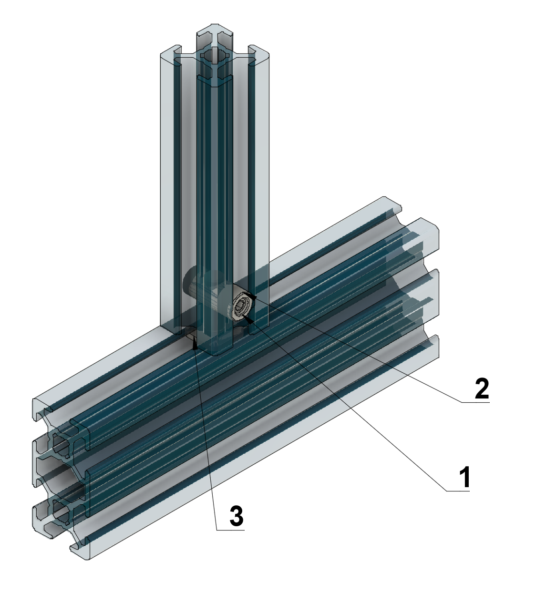

**FIGURE 3.0 Connecting lengths of aluminium extrusion together**. **Fast connector screw** (1 and 2), used to tighten into the **fast connector slide pin** (3). 

** ****

***In the guide we refer to 2020 extrusion, which is 20 mm x 20 mm in cross section, whereas 2040 extrusion is 20 mm x 40 mm in cross section. 2020 extrusion with a rounded corner is also used on each outer upright corner of the instrument.***. 


**FIGURE 3.2 Frame design**. 

**3.1** Start by constructing the rear of the frame (2 x **2040-336mm-RAIL**, 2 x **2020-416mm-RAIL**. Take each **2020-416mm-RAIL**, and into the inside groove slide in 4 **FAST-CONNECTOR-SLIDE-PIN** into each rail. Insert the **FAST-CONNECTOR-SCREW** into each **2040-336mm-RAIL**, move these in position following the diagram in Figure 2, and then tighten each screw using the 3mm allen key. 


**3.2**Then add the horizontal rails into this rear frame (8 x **2040-356mm-RAIL**, 2 x **2020-418mm-ROUNDED-RAIL**). Lie down the assembled rear frame on the back face and then insert 4 **FAST-CONNECTOR-SLIDE-PIN** into the upward facing grooves. Insert the **FAST-CONNECTOR-SCREW** into each **2040-356mm-RAIL**, and insert these rails into the **FAST-CONNECTOR-SLIDE-PIN**. Do not tighten the allen keys at this stage, otherwise you will be unable to carry out the following steps. Insert 2 **FAST-CONNECTOR-SLIDE-PIN** into each **2020-418mm-ROUNDED-RAIL**. Insert the **2020-418mm-ROUNDED-RAIL** inline with the rear **2020-416mm-RAIL**. The spacing of each of the horizontal **2040-356mm-RAIL** must be established to fit each of the side panels. Use each of the side panels to adjust the spacing of these rails. Once all of these are in place, tighten all screws using the 3mm allen key.

 

**3.3**Take each of the **2020-356mm-RAIL** and insert the **FAST-CONNECTOR-SCREW**. Then insert each of the **FAST-CONNECTOR-SLIDE-PIN** into the ends of the **2020-356mm-RAIL**. The **2020-356mm-RAIL** used to mount the humidification chamber must be inserted so that the fast connectors are facing horizontally, i.e. the screws used to tighten the fast connectors are facing forwards, not upwards. This means there is then space at the end of each of these rails to attach the humidification chamber. Make sure to orient the slide pins so that the grooves are in line with the **FAST-CONNECTOR-SCREW**. Slide the rails and the **FAST-CONNECTOR-SLIDE-PIN** into the 2nd from the top **2040-356mm-RAIL**. Do not tighten these screws as they will have to be aligned with the humidification chamber mounts later in the build. 


**3.4**Next, assemble the front of the frame. Take the remaining 2 x **2020-416mm-RAIL** and insert 2 **FAST-CONNECTOR-SLIDE-PIN** into the inward facing grooves on each rail. Inset the **FAST-CONNECTOR-SCREW** into the 2 remaining **2040-336mm-RAIL**,  and assemble these as per the diagram. Again, use the front panel to adjust the spacing between the top and bottom **2040-336mm-RAIL**. Insert **FAST-CONNECTOR-SCREW** and **FAST-CONNECTOR-SLIDE-PIN** into the ends of each of the horizontal **2040-356mm-RAIL**. Then slide in the assembled front rails into **FAST-CONNECTOR-SLIDE-PIN** in the horizontal **2040-356mm-RAIL**. Do no tighten the screws. Finally, slide into place the 2 remaining **2020-418mm-ROUNDED-RAIL** alongside the front frame. Once all are in place, tighten the **FAST-CONNECTOR-SCREW** using the 3mm allen key. 


**3.5** To finish, insert the plastic end rail covers (4 x **END-RAIL-COVER** and 4 x **END-RAIL-COVER-ROUNDED**). **PANEL-FIXINGS** can then be added to each of the railings. These are added on the underside and bottom of the **2040-356mm-RAIL** and **2040-336mm-RAIL**, and can be spaced out using the complementary panels. Do not fix the panels yet as they will get in the way of subsequent steps.


-----------------
### 4.0 BACK CORNERS
-----------------

***The back corners are central to effective routing of the belts that create X and Y movement of the instrument. The knobs at the rear of the back corner contribute to this functioning by allowing adjustment of the tension of each of the two belts in the instrument.***

| **Parts** | **Shorthand Name**                     |**QUANTITY**|
|-----------|----------------------------------------|-------------|
| ***Printed*** |                                    |             |
| LEC_003_P_01_BACK-CORNER_L | BACK-CORNER_L         | 1           |
| LEC_003_P_02_BACK-CORNER_R | BACK-CORNER_R         | 1           |
| LEC_003_P_03_PULLEY_L | PULLEY-L                  | 1           |
| LEC_003_P_04_PULLEY_R | PULLEY-R                  | 1           |
| LEC_003_P_05_KNOB | KNOB                           | 2           |
| ***Components*** |                                 |             |
| LEC_003_C_01_F623ZZ-BEARING | F623ZZ-BEARING       | 4           |
| ***Fixings*** |                                    |             |
| LEC_003_F_01_M3-16MM_SOCKETHEAD-SCREW | M3-16mm_SOCKETHEAD-SCREW | 2|
| LEC_003_F_02_M3-WASHER | M3-WASHER                | 6           |
| LEC_003_F_03_M4-40MM_HEX-BOLT | M4-40MM_HEX-BOLT  | 2           |
| LEC_003_F_04_M4-HEX-NUT | M4-HEX-NUT              | 2           |
| LEC_003_F_05_M5-10MM_BUTTONHEAD-SCREW | M5-10MM_BUTTONHEAD-SCREW | 8|
| LEC_003_F_06_M5-SLIDE-NUT | M5-SLIDE-NUT        | 8           |


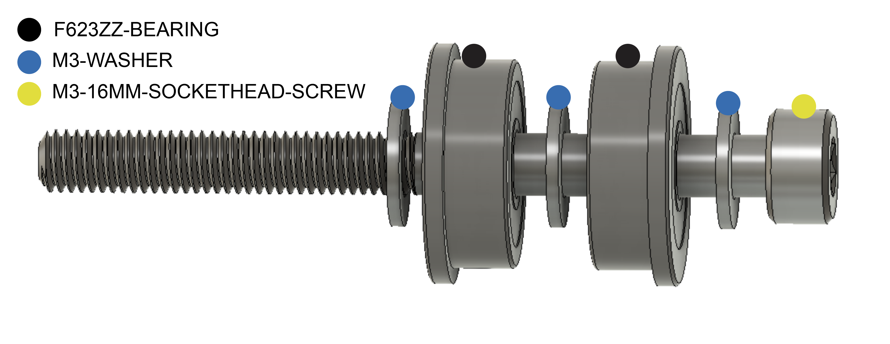

**FIGURE 4.0 FIGURE**


**4.1** The back corners of the LECs are used to feed through the belts, and to adjust the tension of these. Start by constructing each of the rear tensioners, and the associated tensioner knobs. Into the **PULLEY_L** and **PULLEY_R**, screw in the **M4_40mm_HEX-BOLT** so that the thread is sticking out of the back. Next, screw in the **M3_16mm_SOCKETHEAD-SCREWS** into just the base of each and screw each of the components into the inside of the pulleys in this order: **M3_WASHER**, **F623ZZ-BEARING**, **M3_WASHER**, **F623ZZ-BEARING**, **M3_WASHER**. 


**4.2.** Next, we need to attach the **BACK-CORNER_L** and **BACK-CORNER_R**. Start by adding the **M5_SLIDE-NUTS** into the frame. For each side, add 2 **M5_SLIDE-NUTS** into the inside top groove of the **2040-356mm-RAIL** that is 2nd from the bottom, and 2 **M5_SLIDE-NUTS** to the back of the **2020-416mm-RAIL**. Then fix the **BACK_CORNER_L** and **BACK_CORNER_R** in place. Line up the **M5_SLIDE-NUTS** inline with the screw holes on each 3D printed part, and screw these place using the **M5_10mm_BUTTONHEAD-SCREWS**. 


**4.3** Finally, push each of the assembled pulleys into the groove of the **BACK-CORNER_L** and **BACK-CORNER_R** so that the thread of the **M4_40mm_HEX-BOLTS** is coming out of the back of the machine. Insert **M4_HEX-NUTS** into the groove at the rear of the **KNOB**, and then loosely screw on each of the knobs to the thread of the **M4_40mm_HEX-BOLTS**. 


-----------------
### 5.0 FRONT CORNERS
-----------------

***The front corners are complex parts that are crucial for effective functioning of the instrument. The belts must follow the outlined routes, and in the correct orientation, for the LEC to work as it should.***

| **Parts** | **Shorthand name**                    |**QUANTITY** |
|-----------|----------------------------------------|-------------|
| ***Printed*** |                                    |             |
| LEC_004_P_01_BOTTOM-FRONT-CORNER-LEFT | BOTTOM-CORNER-L     | 1|
| LEC_004_P_02_BOTTOM-FRONT-CORNER-RIGHT | BOTTOM-CORNER-R     |1|
| LEC_004_P_03_TOP-FRONT-CORNER-LEFT | TOP-CORNER-L | 1     |
| LEC_004_P_04_TOP-FRONT-CORNER-RIGHT | TOP-CORNER-R | 1     |
| LEC_004_P_05_BOTTOM-SMALL-LEFT-BRACKET | BOTTOM-SMALL-L | 1     |
| ***Components*** |                                 |             |
| LEC_004_C_01_F623ZZ-BEARING | F623ZZ-BEARING        | 12           |
| LEC_004_C_02_XY-STEPPER | XY-STEPPER                | 2           |
| LEC_004_C_03_TIMING-PULLEY | TIMING-PULLEY          | 2           |
| ***Fixings*** |                                     |             |
| LEC_004_F_01_M3-15MM-SOCKETHEAD-SCREW | M3-15MM-SOCKETHEAD-SCREW | 6|
| LEC_004_F_02_M3-35MM-SOCKETHEAD-SCREW | M3-35MM-SOCKETHEAD-SCREW | 6|
| LEC_004_F_03_M3-WASHER | M3-WASHER                  | 18          |
| LEC_004_F_04_M3-HEX-NUT | M3-HEX-NUT                   | 6           |
| LEC_004_F_05_M5-10MM-SOCKETHEAD-SCREW | M5-10MM-SOCKETHEAD-SCREW | 2|
| LEC_004_F_06_M5-20MM-BUTTONHEAD-SCREW | M5-20MM-BUTTONHEAD-SCREW | 2|
| LEC_004_F_07_M5-SLIDE-NUT | M5-SLIDE-NUT             | 8          |


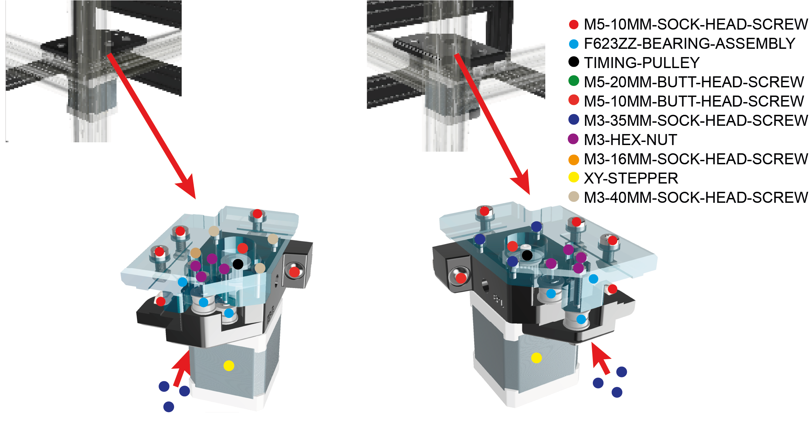

**FIGURE 5.0. Front corners, with the **


**5.1.** The front corners are used to route the XY belts through the stepper motors. Start by adding the **BOTTOM-CORNER_L**, **BOTTOM-CORNER_R** and **LOW-CORNER-BRACKET_L** to the front corners of the frame. These are attached using **M5_10mm_SOCKETHEAD-SCREW**,  **M5_20mm_BUTTONHEAD-SCREW** and **M5_SLIDE-NUT**. To attach these, screw each of the screws in place, and loosely screw the slide nuts onto the thread of these. Push the entire piece into place in the frame and then tighten the screws using an allen key. 


**5.2.** Next, we need to assemble the bearings and stepper motors used to route the belts into the bottom front corner pieces. Start by attaching each of the **XY-STEPPER** to the bottom corner pieces. When viewed from the top, this will mean screwing a **M3_15mm_SOCKETHEAD-SCREW** into the top left and top right of the left and right bottom corner pieces, and **XY-STEPPER** screw holes respectively. Leave the **XY-STEPPER** attached by the single screw. 


**5.3.** Next, screw in 3 **M3_35mm_SOCKETHEAD-SCREW** into the underside of the **BOTTOM-CORNER_L** and **BOTTOM-CORNER_R**. Screw these in leaving approximately 12mm of thread facing vertically out of bottom corner pieces. Onto each of these threads, add these fixings in this order: **M3_WASHER**, **F623ZZ-BEARING**, **M3_WASHER**, **F623ZZ-BEARING**, **M3_WASHER**. Then, to the thread of the stepper motor, add the **TIMING-PULLEY**. The top of the timing pulleys should be at approximately the same height as the bottom corner pieces, and are screwed in place using an allen key. 


**5.4.** The top corner pieces are left out at this point, as we must assemble other components (**LEC_005_A_Y-CARRIAGE**, **LEC_006_A_X-CARRIAGE**, **LEC_007_A_BELTS**) first. 


-----------------
### 6.0 Y-AXIS
-----------------

***The y-carriage is responsible for front to back movement of the instrument. It relies on two linear rails mounted on either side of the instrument. Proper mounting of these two linear rails is important to prevent binding of the instrument during movements along the y-axis.***

| **Parts** | **Shorthand Name **                    |**QUANTITY**|
|-----------|----------------------------------------|-------------|
| ***Printed*** |                                    |             |
| LEC_005_P_01_YAXIS-LOWER | YAXIS-LOWER         | 2           |
| LEC_005_P_02_YAXIS-UPPER | YAXIS-UPPER         | 2           |
| LEC_005_P_03_YAXIS-LIMSWITCH-MOUNT | YAXIS-LIMSWITCH-MOUNT | 1   |
| LEC_005_P_04_YAXIS-LIM-TRIG | YAXIS-LIMIT-TRIGGER | 1   |
| ***Components*** |                                  |             |
| LEC_005_C_01_YAXIS-CARRIAGE-L | YAXIS-CARRIAGE-L    | 1           |
| LEC_005_C_02_YAXIS-CARRIAGE-R | YAXIS-CARRIAGE-R    | 1           |
| LEC_005_C_03_YAXIS-RAIL-L | YAXIS-RAIL-L            | 1           |
| LEC_005_C_04_YAXIS-RAIL-R | YAXIS-RAIL-R            | 1           |
| LEC_005_C_05_F623ZZ-BEARING | F623ZZ-BEARING           | 8           |
| ***Fixings*** |                                     |             |
| LEC_005_F_01_M3_10MM-SOCKETHEAD-SCREW | M3-10MM-SOCKETHEAD-SCREW| 20|
| LEC_005_F_02_M3_12MM-SOCKETHEAD-SCREW | M3-12MM-SOCKETHEAD-SCREW| 8 |
| LEC_005_F_03_M3_35MM-SOCKETHEAD-SCREW | M3-35MM-SOCKETHEAD-SCREW| 4 |
| LEC_005_F_04_M3_50MM-SOCKETHEAD-SCREW | M3-50MM-SOCKETHEAD-SCREW| 1 |
| LEC_005_F_04_M3_60MM-SOCKETHEAD-SCREW | M3-60MM-SOCKETHEAD-SCREW| 1 |
| LEC_005_F_05_M3_WASHER | M3_WASHER                  | 12          |
| LEC_005_F_06_M3_HEX-NUT | M3_HEX-NUT                | 2           |
| LEC_005_F_07_M3_SLIDE-NUT | M3_SLIDE-NUT            | 20          |
| LEC_005_F_08_M5_10MM-SOCKETHEAD-SCREW | M5-10MM-SOCKETHEAD-SCREW | 3 |
| LEC_005_F_09_M5_14MM-SOCKETHEAD-SCREW | M5-14MM-SOCKETHEAD-SCREW | 2 |
| LEC_005_F_10_M5_16MM-SOCKETHEAD-SCREW | M5-16MM-SOCKETHEAD-SCREW | 1 |
| LEC_005_F_11_M5_SLIDE-NUT | M5_SLIDE-NUT            | 8           |

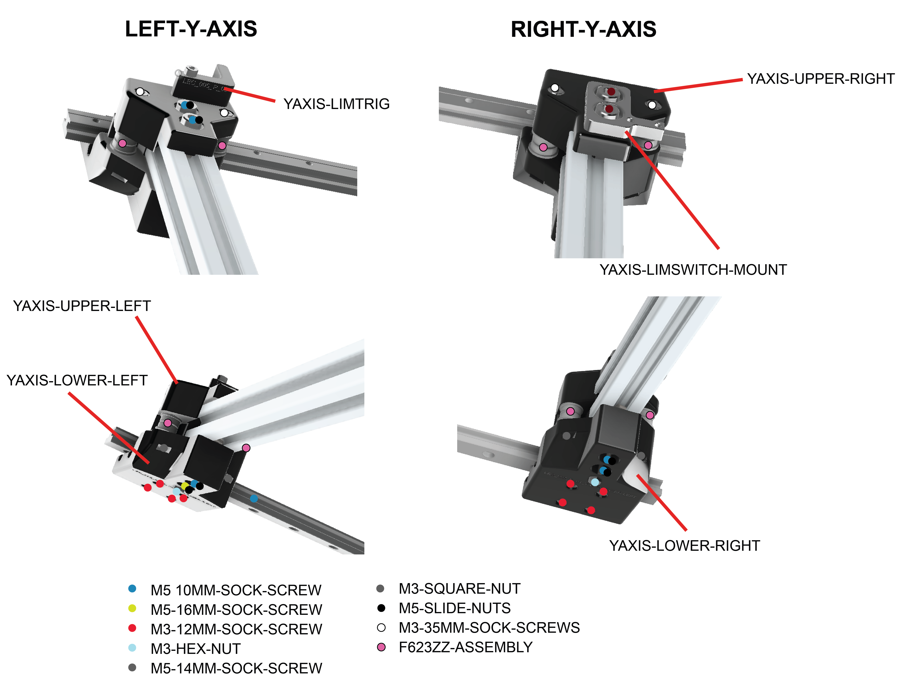

**FIGURE 6.0**


**6.1**. Now, the Y-carriage components need to be added to the frame. Take both the **YAXIS-RAIL_L** and **YAXIS-RAIL_R** and slide on the **YAXIS-CARRIAGE_L** and **YAXIS-CARRIAGE_R** to the end of each of these. 


**6.2.** Attach the **YAXIS-LOWER_L** and **YAXIS-LOWER_R** to the **YAXIS-CARRIAGE_L** and **YAXIS-CARRIAGE_R** respectively, using **M3_12mm_SOCKETHEAD-SCREW**. Into both the **YAXIS-LOWER_L** and **YAXIS-LOWER_R**, screw in **M5_10mm_SOCKETHEAD-SCREW** and **M5_16mm_SOCKETHEAD-SCREW**, and loosely screw on **M5_SLIDE-NUT** to the ends of these. 


**6.3** To attach these to the frame, insert **10mm_COUNTERSUNK-SCREW** into each of the rails, and loosely screw on **M3_SLIDE-NUT** to the threads of these. Insert the assembled rails and slide nuts into the grooves on the underside of the horizontal rails inbetween the front and back corner 3D printed parts. Make sure to push these up against the front corner pieces, and then using an allen key screw these into place. Once attached, the assembled carriages should move freely along the rails. 


**6.4** Next, construct the complimentary upper sections to the carriages. Take the **YAXIS-LIMSWITCH_MOUNT** and screw it into the **YAXIS-UPPER_L** using **M5_14mm_SOCKETHEAD-SCREW**. Then loosely screw on **M5_SLIDE-NUT** to the threads of these. Next, partically screw in **M3_35mm_SOCKETHEAD-SCREW**, so that the threads of the outer two screws are protruding equidistant with the height of the **YAXIS-LOWER_L**, and so the central is not protruding at all. Onto the threads of the outside two **M3_35mm_SOCKETHEAD-SCREW**, add these fixings in this order: **M3_WASHER**, **F623ZZ-BEARING**, **M3_WASHER**, **F623ZZ-BEARING**, **M3_WASHER**. 


**6.5** For the **YAXIS-UPPER_R**, these steps are slightly different. Screw in **M3_10mm_COUNTERSUNK-SCREW**, and loosely screw on **M5_SLIDE-NUT** to the threads of these. Next, take the **YAXIS-LIMTRIG** and screw this partically into the **YAXIS-UPPER_R** using **M3_50mm SOCKETHEAD-SCREW**, so that the thread does not protrude from the opposite hole. Screw in two more **M3_35mm_SOCKETHEAD-SCREW** either side of this, and assembled the fixings as per step **18**.  


**6.6** You should be left with 2 main assembled complimentary upper parts from steps **18** and **19**. Leave these to one side for now, we will attach these once the X-carriage in the next section has been assembled. 


-----------------
### 7.0 X-AXIS
-----------------

*** The x-carriage is the point of attachment for each end of the two belts responsible for X and Y motion. It slides from side to side on the linear rail attached to the 2020 piece of extrusion that creates the y-carriage.***

| **Parts** | **Shorthand Name**                     |**QUANTITY**|
|-----------|----------------------------------------|-------------|
| ***Extrusion*** |                                  |             |
| LEC_006_E_01_2020-318MM | 2020-318MM     | 1           |
| ***Printed*** |                                    |             |
| LEC_006_P_01_X-AXIS-CARRIAGE | Z-AXIS-CARRIAGE | 1   |
| ***Components*** Z|                                |             |
| LEC_006_C_01_X-AXIS-WS-RAIL | X-AXIS-WS-RAIL  | 1           |
| LEC_006_C_02_X-AXIS-WS-CARRIAGE | X-AXIS-WS-CARRIAGE  | 1           |
| LEC_006_C_03_LEADSCREW-NUT | LEADSCREW-NUT          | 1           |
| LEC_006_C_04_LINEAR-BEARING | LINEAR-BEARING        | 4           |
| ***Fixings*** |                                     |             |
| LEC_006_F_01_M4-8MM-SOCKETHEAD-SCREW LEC_006_F_06_M4-8MM-SOCKETHEAD-SCREW  | 4          |
| LEC_006_F_02_M4-16MM-BUTTONHEAD-SCREW | M3-16MM-BUTTONHEAD-SCREW | 4 |
| LEC_006_F_03_M4-SLIDE-NUT | M5_SLIDE-NUT            | 4          |
| LEC_006_F_04_M3-HEX-NUT | M3_HEX-NUT            | 4          |
| LEC_006_F_05_M3-16MM-BUTTONHEAD-SCREW | M3-16MM-BUTTONHEAD-SCREW| 4  |
| LEC_006_F_06_CABLE-TIE-3MM | CABLE-TIE-3MM         | 12           |


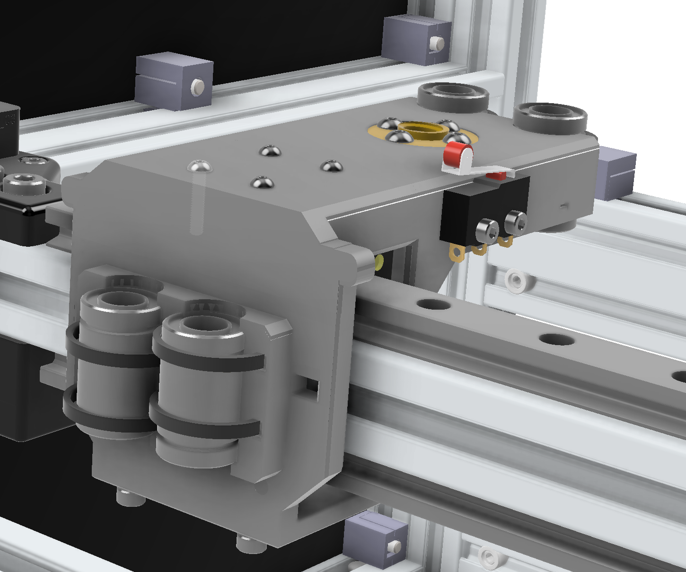

**FIGURE 7.0**

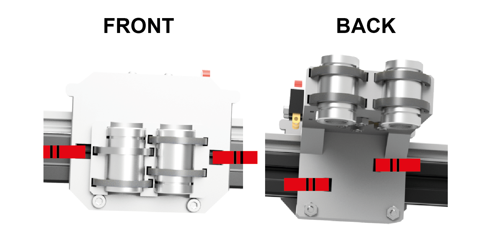
**FIGURE 7.1**


**7.1** The X-carriage is used to mount the Z-carriage. Start by taking the **Z-AXIS-RAIL-UPPER** and **Z-AXIS-RAIL-LOWER** and sliding on the **Z-AXIS-RAIL-CARRIAGE-LOWER** and **Z-AXIS-RAIL-CARRIAGE-UPPER**. Insert **M3_10mm_SUNKENHEAD-SCREW** into the rails and loosely screw on **M3_SLIDE-NUT** to the threads of these. Attach each of the assembled rails to the **2020-318mm-RAIL** and screw this in place. 


**7.2** Next, attach the **2020-318mm-RAIL** to the Y-carriage. Start by slotting the rails into the lower M5 slide nuts from the Y-carriage assembled in stage 16, and screw these in place. Next, turn the entire frame upside down, this will help with the following steps. Take the complimentary upper sections of each side of the Y-carriage assembled in step **18**, and screw these in place, by screwing in the 35mm M3 screws containing the washers and bearings, and M5 screws with attached slide nuts. The X and Y axis should now move freely. 


**7.3** To construct the Z-axis carriage, start by screwing the **LEADSCREW-NUT** into the **Z-AXIS-CARRIAGE-UPPER** using **M3_16mm_BUTTONHEAD-SCREW** and **M3_HEX-NUT**. Next, take each of the **LINEAR-BEARING**, and fix these in place using **CABLE-TIE-5mm**. Make sure that the thread hole of the cable tie is on the outer side of the carriage. Leave this to one side for now, as we need to attach the belts before attaching this to the rail carriages. 


-----------------
### 8.0 X-Y AXIS BELTS
-----------------

***Toothed belts are responsible for creating movement in the X and Y directions, from the movement of the shafters of the X and Y stepper motor shafts. The routing of the belts is important. So too is ensuring that the belts are attached to the x-carriage by looping back around on themselves teeth to teeth, to prevent slipping.***

| **Parts** | **Shorthand Name**                    |**QUANTITY**|
|-----------|----------------------------------------|-------------|
| **Printed** |                                      |             |
| LEC_007_P_01_TOP-CORNER_L | TOP-CORNER_L           | 1           |
| LEC_007_P_02_TOP-CORNER_R | TOP-CORNER_R           | 1           |
| LEC_007_P_03_Z-AXIS-CARRIAGE-LOWER | Z-AXIS-CARRIAGE-LOWER | 1   |
| **Components** |                                    |             |
| LEC_007_C_GT2-BELT | GT2-BELT                       | 2 |
| **Fixings** |                                       |             |
| LEC_007_F_01_M2.5-10MM_BUTTONHEAD-SCREW | M2.5-10MM-BUTTONHEAD-SCREW  | 4 |
| LEC_007_F_03_M2.5-12MM_BUTTONHEAD-SCREW | M2.5-12MM-BUTTONHEAD-SCREW   | 4 |
| LEC_007_F_06_M3-18MM-BUTTONHEAD-SCREW | M3_18MM-BUTTONHEAD-SCREW | 4 |
| LEC_007_F_01_M3-35MM-SOCKETHEAD-SCREW | M3_35MM-SOCKETHEAD-SCREW | 6 |
| LEC_007_F_02_M5-10MM-SOCKETHEAD-SCREW | M5_10MM-SOCKETHEAD-SCREW | 2 |
| LEC_007_F_03_M5-SLIDE-NUT | M5_SLIDE-NUT            | 6           |
| LEC_007_F_04_CABLE-TIE-5MM | CABLE-TIE-5MM          | 8           |


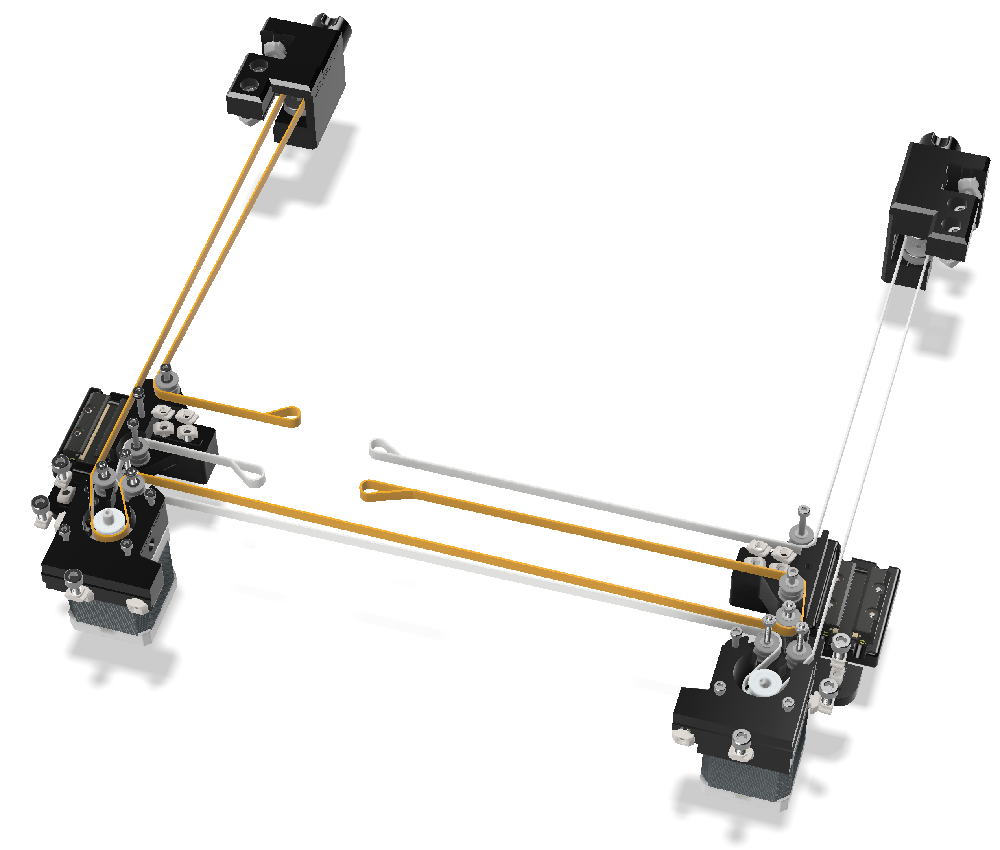

***FIGURE 8.0. Belt routing with top front corner parts removed for clarity, and belts coloured to aid clarity. Belts attach to the x-carriage*** 


***NOTE: Each belt, loops through the belt tensioners at the back of the instrument. Once the belt has followed the path, loop around the carriage in the same way as for the other end. At this stage, make sure that the belt tensioner is inserted into the rear of the instrument, and the tensioner knob is screwed on loosely. This is important, to ensure sufficient belt before cutting. Pull the belt tight with a pair of pliers along its route and then secure with a cable tie. Now you can cut the belt.***


**8.1** You should start with two **GT2-BELTS**. Take one end, and pass it through the hole on the Z-carriage constructed in step **23**, and loop it back on itself. The teeth of the **GT2-BELT** should lock into eachother. Secure this in place using two **CABLE-TIE-5mm**. Do the same with the second belt on the opposite end of the carriage. Route the belts through the front corner, Y carriage and back corners as per the diagram, and secure each belt to the back of the z-carriage using the same method described earlier in this step. When routing the belts through the Y-carriage, you may need to use a pair of tweezers to pull the belt through. 


**8.2** Now the belts have been routed and attached to the Z-axis carriage, attach the Z-axis carriage to the upper rail carriage on the upper X rail using **M2.5_12mm_BUTTONHEAD-SCREW**. Screw the **Z-AXIS-CARRIAGE-LOWER**  to the lower rail carriage using **M2.5_10mm_BUTTONHEAD-SCREW**. The **Z-AXIS-CARRIAGE-LOWER** is also screwed to the Z-carriage constructed in step **23** using **M3_18mm_BUTTONHEAD-SCREW**. 


**8.3**ADD STEP TO ATTACH THE FRONT CORNERS. LEFT HAND SIDE NEEDS SMALLER M3 SCREWS TO ATTACH STEPPER MOTORS, 35MM CURRENTLY TOO LONG. IDEALLY NEED 30MM. 


**8.4** Once the belts and Z-carriage are in place, tighten the belts using the back corner knobs constructed in step **10**. 

***The belt should then be tightened, by using the tensioner knobs at the back of the instrument, pulling the belts backwards. They should be sufficiently tight so as not to be sagging, but not 'guitar string' tight.***


-----------------
### 9.0 Z-AXIS
-----------------

***The z-carriage carries the optics - including the camera, lens and light, and enables movement up and down. The carriage is mounted on the x-carriage and slides up and down on rods, driven by a leadscrew attached to the z-axis stepper motor***

| **Parts** | **Shorthand Name**                    |**QUANTITY**|
|-----------|----------------------------------------|-------------|
| ***Printed*** |                                    |             |
| LEC_008_P_01_Z-CARRIAGE | Z-CARRIAGE               | 1           |
| LEC_008_P_02_LIGHT-BRACKET-TOP | LIGHT-BRACKET-TOP | 1           |
| LEC_008_P_03_LIGHT-BRACKET-BOTTOM | LIGHT-BRACKET-BOTTOM | 1     |
| LEC_008_P_04_OPTICS-MOUNT | OPTICS-MOUNT           | 1           |
| LEC_008_P_05_CAM-MOUNT | CAM-MOUNT                 | 1           |
| LEC_008_P_06_RAIL-INSERT | RAIL-INSERT             | 1           |
| LEC_008_P_07_OPTIC-SCREW | OPTIC-SCREW             | 1           |
| LEC_008_P_08_ZLIM-TRIGGER | ZLIM-TRIGGER           | 1           |
| LEC_008_P_09_BACK-ROD-SECURE | BACK-ROD-SECURE     | 2          |
| LEC_008_P_10_FRONT-ROD-SECURE | FRONT-ROD-SECURE   | 2          |
| LEC_008_P_11_LIGHT-MOUNT | LIGHT-MOUNT             | 1           |
| LEC_008_P_12_LIGHT-KNOB | LIGHT-KNOB               | 1           |
| LEC_008_P_13_LIGHT-DIFFUSER | LIGHT-DIFFUSER       | 1           |
| LEC_008_P_14_LIGHT-SLIDER | LIGHT-SLIDER       | 1           |
| ***Components*** |                                 |             |
| LEC_008_C_01_Z-STEPPER | Z-STEPPER                 | 1           |
| LEC_008_C_02_CAM | CAM                             | 1           |
| LEC_008_C_03_CAM-HDMI | CAM-HDMI                             | 1      |
| LEC_008_C_04_LENS | LENS                           | 1           |
| LEC_008_C_05_KFL08 | KFL08-BEARING                 | 1           |
| LEC_008_C_06_FLEX-COUPLING | FLEX-COUPLING         | 1           |
| LEC_008_C_07_Z-SCREW | Z-SCREW                     | 1           |
| LEC_008_C_08_F-ROD | F-ROD                         | 2           |
| LEC_008_C_09_R-ROD | R-ROD                         | 2           |
| LEC_008_C_10_LED-RING | LED-RING                   | 1           |
| LEC_008_C_11_Z-LEADSCREW | LEADSCREW                   | 1           |
| ***Fixings*** |                                    |             |
| LEC_008_F_01_M2.5-10MM-SOCKETHEAD-SCREW | M2.5-10MM-SOCKETHEAD-SCREW   | 4 |
| LEC_008_F_02_M3-10MM-SOCKETHEAD-SCREW | M3-10MM-SOCKETHEAD-SCREW       | 3 |
| LEC_008_F_03_M3-12MM-SOCKETHEAD-SCREW | M3-12MM-SOCKETHEAD-SCREW | 11|
| LEC_008_F_04_M3-HEX-NUT | M3-HEX-NUT               | 8           |
| LEC_008_F_05_M5-10MM-SOCKETHEAD-SCREW | M5-10MM-SOCKETHEAD-SCREW | 2 |
| LEC_008_F_06_M5-HEX-NUT | M5-HEX-NUT               | 2           |
| LEC_008_F_06_M2.5-12MM | M2.5-12MM-SOCK-SCREW               | 2     |


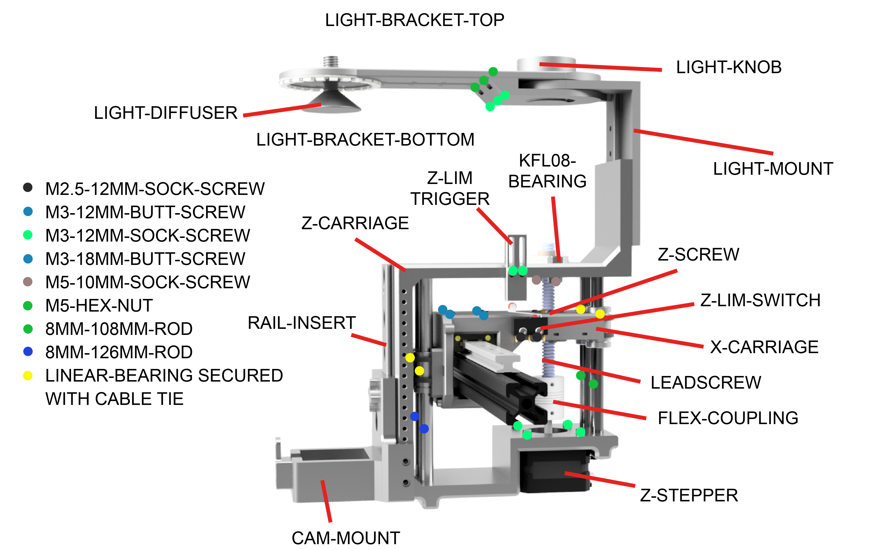

**FIGURE 9.0. Z-axis assembly** 


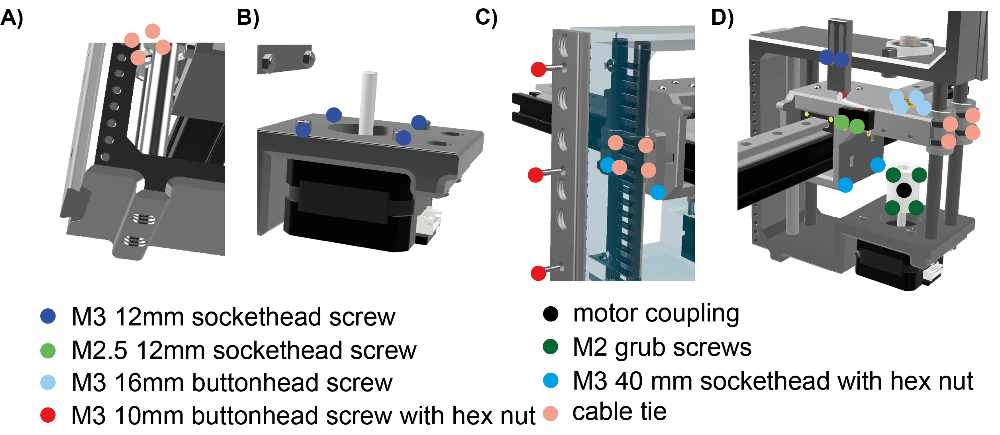

**FIGURE 9.1 Z-axis assembly 2**


**9.1** Start by attaching various printed parts and components to the **Z-CARRIAGE**. Start by screwing the **RAIL-INSERT** to the **Z-CARRIAGE** using **M3_12mm_SOCKETHEAD-SCREW**. Next, attach the **ZLIM-TRIGGER** using **M3_12mm_SOCKETHEAD-SCREW**, attach the **KFL08** using **M5_10mm_SOCKETHEAD-SCREW** and **M5_HEX-NUT**, and attach the **Z-STEPPER** using **M3_12mm_SOCKETHEAD-SCREW**. Finally, attach the **FLEX-COUPLING** to the drive shaft of the **Z-STEPPER**, which should be secured using ..

**9.2**. Next, we need to attach the **Z-CARRIAGE** to the Z-carriage on the X-rail. To do this, orient the **Z-CARRIAGE** as per the diagram, and pass the two **F-ROD** (longer rods) through the holes on the front underside of the **Z-CARRIAGE**. The rods need to pass through the linear bearings attached to the Z-carriage on the Z-rail, before slotting into the grooves on the underside of the top face of the **Z-CARRIAGE**. Gently tap these into place, and screw in the **FRONT-ROD-SECURE** to secure these rods in place. Do the same for the **R-ROD** (shorter rods) and secure these using **BACK-ROD-SECURE**. Finally, pass the **Z-SCREW** through the **KFL08** and screw it into the **FLEX-COUPLING**. Secure this in place by screwing the **Z-SCREW** into the **KFL08**. Gently turning the **FLEX-COUPLING** should now move the **Z-CARRIAGE** up and down. 

**9.3** Next, attach the **OPTICS-MOUNT** and **LIGHT-MOUNT** by slotting them into the front and of the **Z-CARRIAGE** respectively. Screw the **OPTIC-SCREW** into the **CAM-MOUNT**, and screw the **CAM-MOUNT** into the **CAM-MOUNT** using **M2.5_10mm_SOCKETHEAD-SCREW**. 

**9.4** Finally, assemble the bracket for the light ring. Attach the **LIGHT-BRACKET-TOP** to the **LIGHT-BRACKET-BOTTOM** using **M3_10mm_SOCKETHEAD-SCREW** and **M3_HEX-NUT**. Leave this assembly to one side for now, as we need to solder and wire up the light ring before attaching it to the **LIGHT-MOUNT**. 


-----------------
### 10.0 ELECTRONICS
-----------------

***The electronics of the LabEmbryoCam are concentrated in the electronics enclosure mounted on the rear of the instrument. A number of wiring looms and individual cables, connect this to different parts of the instrument, via labelled ports on the electronics enclosure***


| **PARTS** | **SHORTHAND NAME**                       |**QUANTITY**|
| ----------|------------------------------------------|-------------|
| ***3D PRINTED*** |                                      |             |
| LEC_009_P_01_MOUNTING-PLATE | MOUNTING-PLATE         | 1           |
| LEC_009_P_02_PORT-PLATE | PORT-PLATE         | 1           |
| LEC_009_P_03_FAN-PLATE | FAN-PLATE         | 1           |
| LEC_009_P_04_FRONT-BREAKOUT-MOUNT | FRONT-BOARD-MOUNT        | 1      |
| LEC_009_P_05_CABLE-MOUNT | CABLE-MOUNT         | 8          |
| LEC_009_P_06_R-FRONT-PANEL | R-FRONT-PANEL         | 1          |
| LEC_009_P_07_L-FRONT-PANEL | L-FRONT-PANEL         | 1          |
| LEC_009_P_08_ELEC-MOUNT-BOTTOM | BOTTOM-ENCLOSURE-BRACKET | 1   |
| LEC_009_P_09_ELEC-MOUNT-TOP | TOP-ENCLOSURE-BRACKET| 1          |
| LEC_009_P_10_MICROCONTROLLER-BRACKET | MICROCONTROLLER-BRACKET| 1     |
| LEC_009_P_11_DISPLAY-FASCIA | DISPLAY-FASCIA| 1          |
| LEC_009_P_12_DISPLAY-REAR | DISPLAY-REAR| 1          |
| LEC_009_P_13_DISPLAY-ARM | DISPLAY-ARM| 1          |
| LEC_009_P_14_DISPLAY-BRACKET | DISPLAY-BRACKET| 1          |
| LEC_009_P_15_CABLE-BRACKET | CABLE-BRACKET| 10          |
| LEC_009_P_16_Y-LIM-SWITCH-MOUNT | Y-LIM-SWITCH-MOUNT| 1          |
| ***COMPONENTS*** |                                  |             |
| LEC_009_C_01_THOR-ELEC-ENC | ELECTRONICS-ENCLOSURE | 1       |
| LEC_009_C_02_THOR_ELEC-ENC-BASEPLATE | ELECTRONICS-BASE-PLATE| 1    |
| LEC_009_C_03_RPI4 | RPI4                             | 1            |
| LEC_009_C_04_USB-HUB | USB-HUB                       | 1            |
| LEC_009_C_05_PSU-SEASONIC300SUG | PSU-SEASONIC300SUG | 1            |
| LEC_009_C_06_DUET | DUET                             | 1            |
| LEC_009_C_07_ARDUINO | ARDUINO                       | 1            |
| LEC_009_C_08_RJ45-CONN | RJ45-CONN                   | 1            |
| LEC_009_C_09_SWITCH | SWITCH                         | 1            |
| LEC_009_C_10_HDMI-CONN | HDMI-CONN                   | 2            |
| LEC_009_C_11_USB-CONN | USB-CONN                     | 3           |
| LEC_009_C_12_DB15-M-CONN | DB15-M-CONN               | 1            |
| LEC_009_C_13_DB25-M-CONN | DB25-M-CONN               | 1            |
| LEC_009_C_14_ATX-BREAKOUT | ATX-BREAKOUT             | 1            |
| LEC_009_C_15_CASE-FAN | CASE-FAN                       | 1            |
| LEC_009_C_16_RPI_FAN | RPI_FAN                       | 1    |
| LEC_009_C_17_CSI-HDMI-CAM-HAT | CAM-HAT                | 1            |
| LEC_009_C_18_RPI-HQ-CAM | CAM                | 1            |
| LEC_009_C_19_LENS | LENS                | 1            |
| LEC_009_C_20_HDMI-F-F-COUPLER | HDMI-COUPLER         | 1            |
| LEC_009_C_21_USB-C-R-ANGLE-CABLE | USB-C-R-ANG         | 2            |
| LEC_009_C_22_MICRO-HDMI-R-ANGLE-CABLE | U-HDMI-CABLE  | 1            |
| LEC_009_C_23_USD-CARD | USD-CARD  | 1            |
| LEC_009_C_24_USBA-ARDUINO | ARD-USB  | 1            |
| LEC_009_C_25_USBMIC-DUET | DUET-USB  | 1            |
| LEC_009_C_26_DISPLAY-HDMI | DISP-HDMI  | 1            |
| LEC_009_C_27_DISPLAY-USB | DISP-USB  | 1            |
| LEC_009_C_28_DISPLAY | DISPLAY  | 1            |
| LEC_009_C_28_JOYSTICK | JOYSTICK  | 1            |
| LEC_009_C_28_Z-BUTTONS | Z-BUTTONS  | 2            |
| ***FIXINGS*** |      |      |
| LEC_009_F_01_M3_12mm_COUNTERSUNK-SCREW | M3_12mm_COUNTERSUNK-SCREW | 3 
| LEC_009_F_02_M3_DB-JACK-SCREW-HEAD | JACK-SCREW | 4    |
| LEC_009_F_03_M3_NYLOC-NUT | NYLOC-SCREW | 4    |
| LEC_009_F_04_M3_USB-SCREWS | NYLOC-SCREW | 1    |
| LEC_009_F_05_TRIPOD-SCREW | CAM-SCREW | 1    |
| LEC_009_F_06_M4-HEX-40MM-SCREW | DISPLAY-HEX-SCREW | 2    |
| LEC_009_F_07_M4-NYLOC-HEX-NUT | DISPLAY-HEX-NUT | 2    |
| LEC_009_F_08_M2.5-8MM-SOCKETHEAD-SCREW | DISPLAY-M2.5-SOCKETHEAD | 4  |
| LEC_009_F_09_M5-6MM-BUTTONHEAD-SCREW | DISPLAY-M5-BUTTONHEAD | 4    |
| LEC_009_F_10_M3-8MM-SOCKETHEAD-SCREW | DISPLAY-M3-SOCKETHEAD | 4    |
| LEC_009_F_11_M5-6MM-BUTTONHEAD-SCREW | CABLE-BRACKET-M5-BUTTONHEAD |10| | LEC_009_F_12_M5-SLIDENUT | M5-SLIDENUT | 14   |
| ***ELECTRONICS ASSEMBLIES*** |      |      |
| LEC_009_A_01_ELEC-ENC | ELECTRONICS-ENCLOSURE | 1    |
| LEC_009_A_02_25PIN-M-ELEC-ENC | 25PIN-ENC | 1    |
| LEC_009_A_03_25PIN-F-EXT | 25PIN-EXT | 1    |
| LEC_009_A_04_15PIN-M-ELEC-ENC | 15PIN-ENC | 1    |
| LEC_009_A_05_15PIN-F-EXT | 15PIN-EXT | 1    |
| LEC_009_A_06_FRONT-BOARD-ASSEMBLY | FRONT-BOARD | 1    |
| LEC_009_A_07_Z-BOARD-ASSEMBLY | Z-BOARD | 1    |


### 10.1 Overview
The LabEmbryoCam build requires six wiring looms, which are treated here as 'assemblies'. 
1. 25 pin wiring loom
    a) Inside the electronics enclosure (25PIN-EXT, 11.X)
    b) From the electronics enclosure to the front panel (25PIN-ELEC-ENC, 11.X)
    c) Front circuitboard assembly (FRONT-BOARD 11.X)
2. 15 pin wiring loom 
    a) Inside the electronics enclosure (15PIN-EXT, 11.X)
    b) From the electronics enclosure to the front panel (15PIN-ELEC-ENC, 11.X)
    c) Z-axis circuitboard assembly (Z-BOARD, 11.X)

For most builders, these will have been provided as already built 'assemblies', and can simply be attached to the relevant parts of the instrument. Nonetheless, for the assembly to be complete, the full details of how to create these wiring assemblies are provided at the end of the electronics section of the build guide, in the sections given for each part above.


-------------------
### 10.2 Electronics Enclosure
-----------------

***Electronics are mounted inside a metal enclosure, with 3D printed endplates, which is attached to the rear of the instrument.***


**FIGURE 10.0**


## Electronics Enclosure (LEC_009_A_01)


**FIGURE 10.1** Electronics enclosure assembly


----
### 10.3 Attaching Internal Components
------

Connect the 3D printed plastic MOUNTING-PLATE to the metal plate of the electronics enclosure. Using M3 XX mm screws.

Begin by attaching the power supply, PSU-SEASONIC300SUG, with four screws - two to attach it to the front panel, and two to attach the back to the MOUNTING plate.

Attach the FAN to the rear fan plate of the electronics enclosure, using the four fan screws, included with it.

Install the USB-HUB using xx MM screws, with the USB-A ports facing the fan, and the USB-C ports facing the PSU.

Attach the ATX-BREAKOUT to the MOUNTING-PLATE using XX MM screws.

Connect the ARDUCAM HDMI-CSI adapter to the top of the RPI4, and then the RPI to the MOUNTING-PLATE, using M2.5 screws.


...FIG..


---------------
### 10.4 Wiring Loom
---------------


**FIGURE 10.2 ** Wiring loom


Two wiring looms connect the majority of the electronic components in the LabEmbryoCam to the electronics enclosure on the rear of the instrument.

Begin by cutting the wires detailed below to the necessary lengths, for each of the looms. Each wire must be terminated with the appropriate conncetion types, and labelled acording to the guide below.


### 10.5 **Wiring Loom 1 - DB25**

***Runs from front of instrument and terminates to a DB25 female connector, that connects to the receptive male port on the electronics enclosure***

| WIRES REQUIRED     |         |             |
| ------------------ |         |  ---------- |
| **Wire type**      |**Function**         |  **Length** |
| 4 Multicore ribbon | X_Stepper_Motor |  100cm      |
| *BLACK* |  |      |
| *BLUE* |  |       |
| *GREEN* |  |        |
| *RED* |  |        |
| 4 Multicore ribbon | Y_Stepper_Motor | 65cm      |
| *BLACK* |  |      |
| *BLUE* |  |       |
| *GREEN* |  |        |
| *RED* |  |        |
| 2 Multicore ribbon | Y_Limit_Switch |  50cm     |
| *BLUE* |  |      |
| *YELLOW* |  |       |
| 2 Multicore ribbon | X_Limit_Switch |  50cm   |
| *BLUE* |  |      |
| *YELLOW* |  |       |


### 10.6 **Front Panel Wiring Hub**


-- change z-but colours

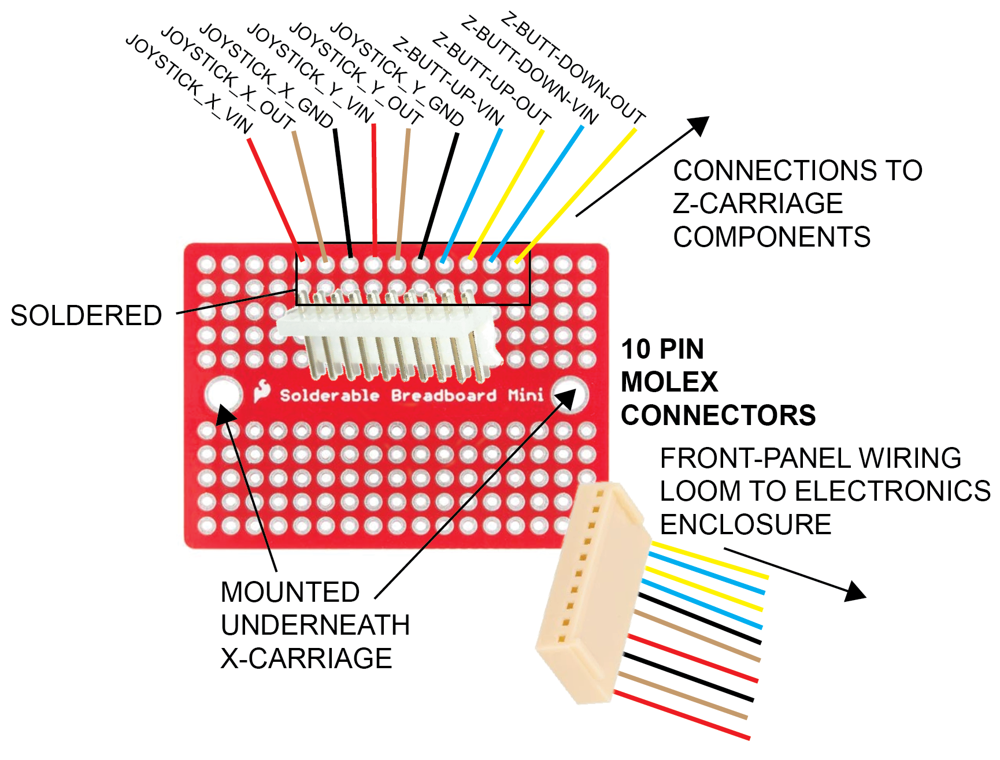
**FIGURE 10.3**


***FIGURE 10.4** FRONT PANEL BREAKOUT ...


-----------
#### 10.7 **Wiring Loom 2 - DB15**
-----------

***Runs from Z-carriage to a DB15 female connector, that connects to the receptive male port on the electronics enclosure***

| WIRES REQUIRED     |                 |            |
| ------------------ | --------------- | ---------- |
| **Wire type**      | **Function**    | **Length** |
| 4 Multicore ribbon | Z_Stepper_Motor | 85cm       |
| 2 Multicore ribbon | Z_Limit_Switch  | 50cm       |
| 4 Multicore ribbon | LED             | 50cm       |


| WIRES REQUIRED                             |              |            |                   |
| ------------------------------------------ | ------------ | ---------- | ----------------- |
| **Wire type**                              | **Function** | **Length** | **Termination A** |
| 4 Multicore ribbon                         | LED          | 50cm       | BARE              |
| 2 Multicore ribbon                         | Z-limit      |            | 25cm              |
| ** double check these z-carriage lengths** |              |            |                   |


Black, Blue, Green, Red


**diagram/lengths needed**


-----------
### 10.8 **Z Wiring Hub**
-----------

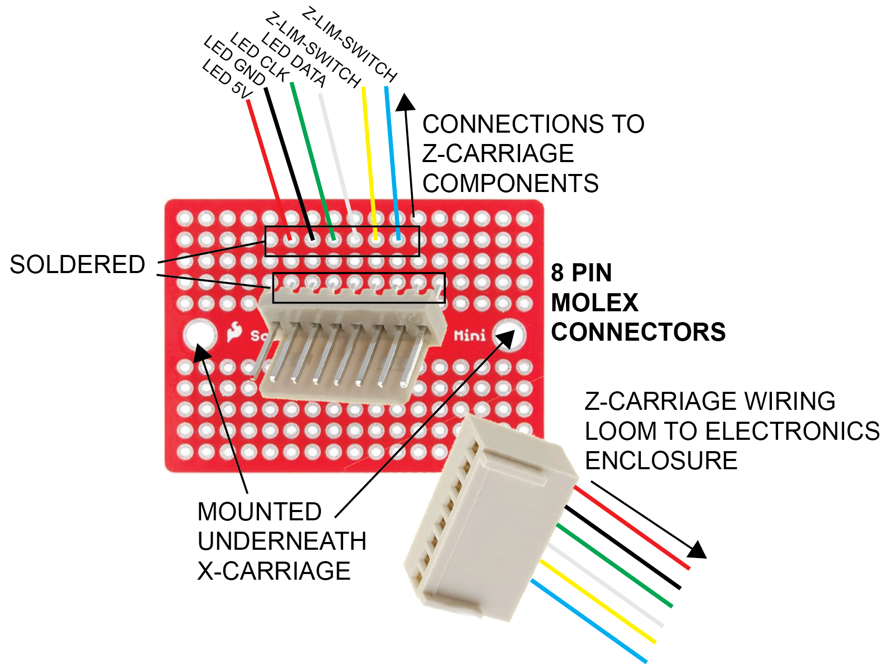
***FIGURE 10.5**. Z-AXIS-BREAKOUT

**diagram/lengths needed**


-----------
### 10.9 Electronics Enclosure Wiring
---------------


| WIRES REQUIRED       |Function  |Length |Termination	|Routing|
| -------------------- | ---- |---| --- | ---|
|***DB25*** | | | | |
| 4 Multicore ribbon   | X Stepper motor| 20cm |Wire -> MOLEX|DB25->DUET|
| 4 Multicore ribbon   | Y Stepper motor|  20cm |Wire -> MOLEX|DB25->DUET|
| 1 x Blue, 1 x Yellow | X Limit switch|  25cm |Wire -> MOLEX|DB25->DUET|
| 1 x Blue, 1 x Yellow | Y Limit switch|  25cm |Wire -> MOLEX|DB25->DUET|
| 4 Multicore ribbon   | Z buttons|  20cm |Wire -> Wire| DB25->ARDUINO|
| 3 Multicore ribbon   | X Joystick|  20cm  |Wire -> Wire|DB25->ARDUINO|
| 3 Multicore ribbon   | Y Joystick|  20cm  |Wire -> Wire|DB25->ARDUINO|
|***DB15*** | | | | |
| 1 x Blue, 1 x Yellow | Z Limit switch|  25cm |Wire -> MOLEX|DB15->DUET|
| 4 Multicore ribbon   | Z Stepper motor|  20cm |Wire -> MOLEX|DB15->DUET|
| 4 Multicore ribbon   | LED | 20cm |Wire -> MOLEX|DB15->ARDUINO|
| **Integrated Cables**       |   |      |        |          |
| HDMI   | Camera signal|  XX  |HDMI->HDMI|UPPER_HDMI_PORT->PI-CSI_BOARD|
| HDMI   | Control panel|  XX  |HDMI->HDMI|LOWER_HDMI_PORT->RPI4 MICROHDMI|
| USB   | Solid State Drive|  XX  |USB->USB|USB PORT->RPI-USB3|
| USB   | Accessory|  XX  |USB->USB|USB PORT->USB-HUB|
| ETHERNET   | Networking|  XX  |RJ45->RJ45|RJ45-PORT->RPI4-RJ45|


Up/down buttons

RG - up

BB - down 

direction on circuit board needs changing..? or microcontroller?


### Cooling..


-----------------
## 12.0 VIBRATION-INSULATION
-----------------

The bottom corners should be attached to the instrument towards the end of the build, to prevent damage during the build process. 

Each corner encompasses two vibration insulation components - a sorbothene foot, and a 3D printed leafspring. Once assembled, care should be taken not to apply too much pressure onto the instrument.

| **Parts**                             | **Shorthand Name**       | **QUANTITY** |
| ------------------------------------- | ------------------------ | ------------ |
| ***Printed***                         |                          |              |
| LEC_002_P_01_FR/BL-BOTTOM-CORNER      | FR/BL_BOTTOM-CORNER      | 2            |
| LEC_002_P_01_FR/BR-BOTTOM-CORNER      | FR/BR_BOTTOM-CORNER      | 2            |
| LEC_002_P_03_LEAFSPRING               | LEAFSPRING               | 4            |
| ***Components***                      |                          |              |
| LEC_002_C_01_SORBOTHENE-FEET          | SORBOTHENE-FEET          | 4            |
| ***Fixings***                         |                          |              |
| LEC_002_F_01_M5_10MM-BUTTONHEAD-SCREW | M5_10MM-BUTTONHEAD-SCREW | 12           |
| LEC_002_F_02_M5-SLIDE-NUT             | M5_SLIDE-NUT             | 12           |
| LEC_002_F_03_M6-12MM_BUTTONHEAD-SCREW | M6_12MM-BUTTONHEAD-SCREW | 4            |
| LEC_002_F_04_M6-45MM_BUTTONHEAD-SCREW | M6_45MM-BUTTONHEAD-SCREW | 4            |
| LEC_002_F_05_M6-HEX-NUT               | M6_HEX-NUT               | 4            |

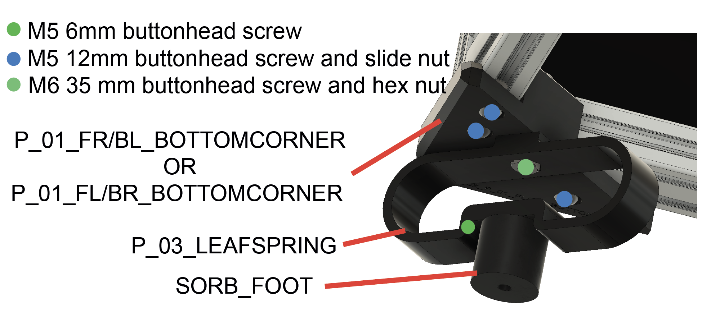
**FIGURE 12.0**

**12.1** The bottom corners are attached to the base of the frame and are required to attach components used to insulate against vibrations, that may cause interference with acquired video footage. Start by attaching the 2 **FR/BL_BOTTOM-CORNER** and 2 **FR/BR_BOTTOM_CORNER** pieces to the underside corners of the assembled frame, using **M5_10mm_BUTTONHEAD-SCREWS** and **M5_SLIDE-NUTS**. 

**12.2** Next, construct the vibration insulating feet to each of the bottom corners. Start by screwing the **SORBOTHENE-FEET** to the **LEAFSPRING** using **M6_12mm_BUTTONHEAD-SCREWS**. Then place **M6_HEX-NUTS** into the grooves within each **LEAFSPRING**. Screw in each of the assembled feet into the bottom corner pieces, using the **M6_HEX-NUTS** and **M6_45mm_BUTTONHEAD-SCREWS**. 


-----------------

### Panel attachment

-----------------

While not essential, attaching plastic panels to the LabEmbryoCam is encouraged as for little cost, they help to keep the instrument clean, protect moving parts and cables and they keep it looking tidy. Note the size of the panels required in the bill of materials and their 
locations above. Before installing the panels, insert M3 square nuts into the holes at the top and bottom of each spacer. The square nuts should slide as far as they can be pushed, using a small allen key or similar, so that the hole in the nut aligns with the hole in the 3D printed spacer.


-----------------
### Manual Controls
---------------

| PARTS REQUIRED                          |                 |
|-----------------------------------------|-----------------|
|**Component description**               |**Qty required** |
| Red wire                                | 755 cm          |
| Green wire                              | 520 cm          |
| Blue wire                               | 620cm           |
| Black wire                              | 595 cm          |
| Yellow wire                             | 350 cm          |
| White wire                              | 325 cm          |
| XY Joysticks                            | 1               |
| Z axis buttons                          | 2               |
| **3D Prints**                           |                 |
| Joystick_panel_right                    | 1               |
| Joystick_panel_left                     | 1               |

Once the joystick and buttons are attached to the front panels, the front panels can then be attached to the LabEmbryoCam.

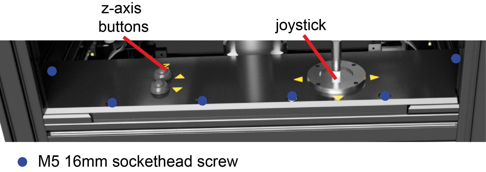
**FIGURE 12.0**

Solder cables to each of the pins on the joystick (2 x 3 cables per axis), and two buttons (2 x 2 cables) and 
then attach the buttons and joystick to the 3D printed front panels. Ensure the cables are labelled to ensure they can be connected 
appropriately to the microcontroller. 

.. note:: Although not essential, joystick and button labels are provided as seperate STLs and can be printed in different colour filaments i.e. begin the print with the label colour, before switching to the colour used for the main body of the part. 


-----------------
### DISPLAY INSTALLATION
-----------------


--------------
### Display installation
------------------
| **Parts**                             | **Shorthand Name**       | **QUANTITY** |
| ------------------------------------- | ------------------------ | ------------ |
| ***Printed***                         |                          |              |
| LEC_002_P_XX      | XX      | 2            |
| LEC_002_P_XX     | XX      | 2            |
| LEC_002_P_03_LEAFSPRING               | LEAFSPRING               | 4            |


--------------
### 13.0 LID
------------------

***While not essential, the lid keeps the instrument clean and offers some protection from interference during an experiment***. 

| **PARTS** | **SHORTHAND NAME**                       |**QUANTITY**|
| ----------|------------------------------------------|-------------|
| ***COMPONENTS*** |                                      |             |
| LEC_010_C_01_HINGE | HINGE         | 2           |
| LEC_010_C_02_TOP-LID-PLASTIC-311X315 | TOP-LID-PLASTIC         | 1    |
| LEC_010_C_03_FRONT-LID-PLASTIC-315X59 | FRONT-LID-PLASTIC        | 1  |
| LEC_010_C_04_HANDLE | HANDLE        | 1  |
| LEC_010_C_05_CUBE-CONNECTORS | CUBE-CONNECTORS        | 6  |
| ***EXTRUSION*** |                                      |             |
| LEC_010_E_01_2020-312MM | 2020-312MM         | 2           |
| LEC_010_E_02_2020-303MM | 2020-303MM         | 3           |
| LEC_010_E_02_2020-60MM | 2020-60MM         | 2           |
| ***FIXINGS*** |                                      |             || |LEC_010_F_01_M5-SLIDENUT | M5-SLIDENUT        | 2  |
|LEC_010_F_01_M5-8MM-SOCKETHEAD-SCREW | M5-8MM-SOCKETHEAD-SCREW      |2|


--------------
## 14.0 TESTING
------------------

***This section is still a work in progress - with testing procedures.***

--------------
### 14.1 Duet Board Testing
------------------
The Duet XYZ board has a control interface not routinely used in the operation of the LEC, but useful during initial setup.

To access it, connect the board directly to a network connection via the ethernet port on the board itself (not the ethernet). Turn on the LEC, and navigate to the Terminal and type ``` cutecom```. 

This will open a window allowing us to determine the IP address of the Duet board on the network. Once open - choose the Device ```/dev/tty/ACMX```, with X usually being either 0, 1 or 2 from the dropdown.

Click 'Open'. If joystick or light is returned, this means you have selected the wrong Device - so try another.

Type ```M115``` and if all is working, you should see the current firmware version.

If so, type ```M552 S0```, followed by ```M552 S1``` to deactivate, and then reactivate the network connection.

You should see 'Network running. IP address = XXX.XXX.X.XXX', with the XXX corresponding to the address of your own instrument on your network.

You can now access the Duet board of the LabEmbryoCam on your network via this IP address, from any other device connected to the same network. You will be prompted for a password. The default password for LabEmbryoCams is ```radix```

To check the input power to the Duet board, use M122 in CuteCom.


--------------
## 14.0 TROUBLESHOOTING
------------------
### Vibrating and/or noisy stepper motor - but no movement
This is typically caused by a bad connection to the stepper motor caused by either a damaged cable, or incorrect wiring. If the instrument was previously working then incorrect wiring is unlikely. Consider a wholesale replacement of the DB-25 wiring loom. Before doing so, by opening the electronics enclosure you can directly connect the stepper motor to the Duet board to see if this resolves the issue  - if so, you can be assured that wiring is indeed the issue.

