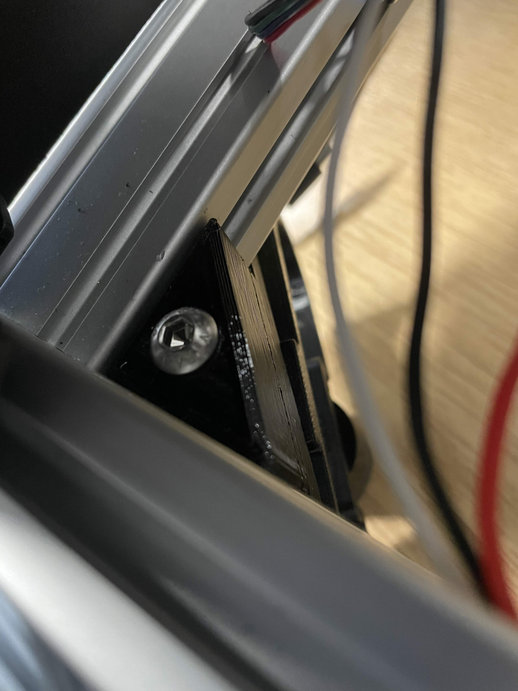
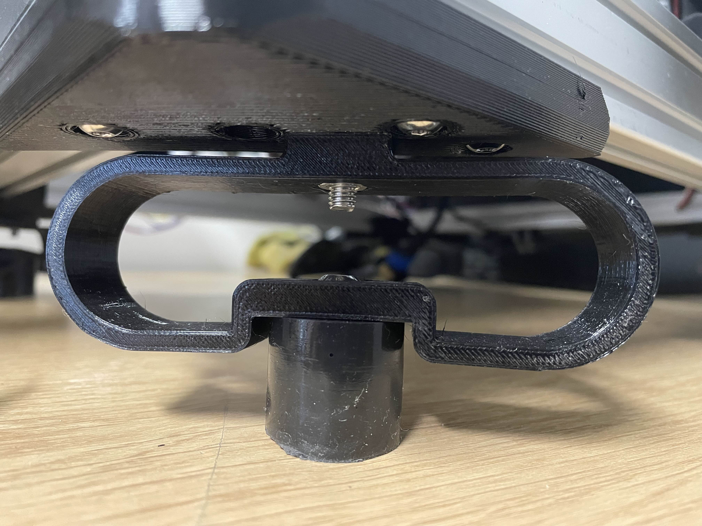

# LabEmbryoCam Unpacking Guide

**This guide follows the steps required to assemble an LEC following receipt after shipping**

-----------------
### 1.0 UNPACKING
-----------------
The LEC can be removed from its packaging using the frame. Avoid using the 'internals' to pull it out, instead using the outer pieces of frame, and be mindful of snagged wires.

-----------------
### 2.0 ELECTRONICS MOUNTING
-----------------
Two 3D printed brackets must be attached to the rear of the instrument to support the LEC electronics enclosure. The lower of the two brackets includes a slot for mounting the data storage (SSD). Consult image below. The brackets are attached to the frame of the LEC using screws and slide nuts. Use the enclosed allen keys to tighten the slide nut up inside the slot and the electronics mounts will be locked in place. The LEC electronics enclosure brackets should be mounted centrally on the rear of the instrument.

Once the two brackets are installed, the LEC electronics enclosure can be slid in from the top of the instrument, with the ports at the bottom, and the fan vent facing upwards.

-----------------
### 3.0 DISPLAY MOUNTING
-----------------
The LEC uses a touch screen display, mounted to the front of the instrument, via an arm on a swivel. The bracket attached to the LEC frame will already be attached. Furthermore, the display will have the swivel arm already attached. Therefore, to fit the display to the frame requires first removing the hex-head screw and nut, aligning the arm, and then reinserting the screw, before tightening up the nut.

Once the LEC display is fitted, a USB-C cable, and HDMI cable must be attached to the display. The USB-C cable is tight. Run the HDMI and USB cables along the same route as the black cable bundle, and use the included cable ties to secure them.

-----------------
### 4.0 ATTACHING CAMERA AND LENS
-----------------
The camera and lens are shipped in the optics holder of the LEC. This slides on to the z-carriage from underneath and is intentionally stiff. The appropriate distance from the end of the lens to the sample holder will depend on the magnification used, and the choice of auxillary lens, which screws onto the end of the lens. A line will be marked on the z-carriage with black marker to indicate a good height to initially mount the optics holder. 

Once the optics holder is fitted, the included HDMI cable should be attached. The cable should be routed, following the same route as the other cables from the z-carriage in the cable bundle. Use the included cable ties to secure the HDMI cable alongside these other cables.

-----------------
### 5.0 ATTACHING CABLES
-----------------
The LEC electronics enclosure fascia has labelled ports. The USB and HDMI cables should be attached to the relevant labelled ports (DISP).

The LEC uses two custom cables - a 25 pin serial style cable, conneced to the X and Y stepper motors and Y, and Y limit switches, and a 15 pin serial style cable, connected to the Z stepper motor, Z limit switch and LED light. These cables have screws on either side, and should be screwed into the female recepticle on the port, to prevent the connector from falling out.

The power cable should be connected to the kettle style connector.

When running the LEC, data should be written to an external drive, preferrably an SSD (Solid State Drive). A cable is included  and the LEC will sit in the slot to the side of the electornics enclosure. The USB cable should be connected to the labelled 'SSD' slot on the electronics enclosure fascia. It is preferrable to attach the drive before powering on the instrument, as they will not always be detected if plugged in when the LEC is already powered up.

-----------------
### 6.0 FITTING FEET
-----------------
While the LEC can be used with the vibration insulating feet, experiments will inevitably be impacted by vibrations from the environment without them. Fitting them simply requires four screws to be attached. It is important to note that the feet are fragile. The 3D printed plastic leafspring parts will snap if excessive weight is placed on the instrument. For this reason, spare feet are provided and the sorbothene (rubber) part can be screwed onto a new 3D printed leafspring if required.

To fit the feet, lie the instrument on its side and use the included allen key to attach the screw the foot to the instrument using the included screws.

 

-----------------
### 6.0 TURNING ON
-----------------
To turn the LEC on, use the ON/OFF toggle switch on the port end of the LEC. Follow the instructions in the USER MANUAL for operation of the LEC. However, given that this is the first operation post-shipping, a few things should be checked for.

i) Ensure that the cables at the bottom and rear of instrument have sufficient slack when attaching them to the cable holders with cable ties.
