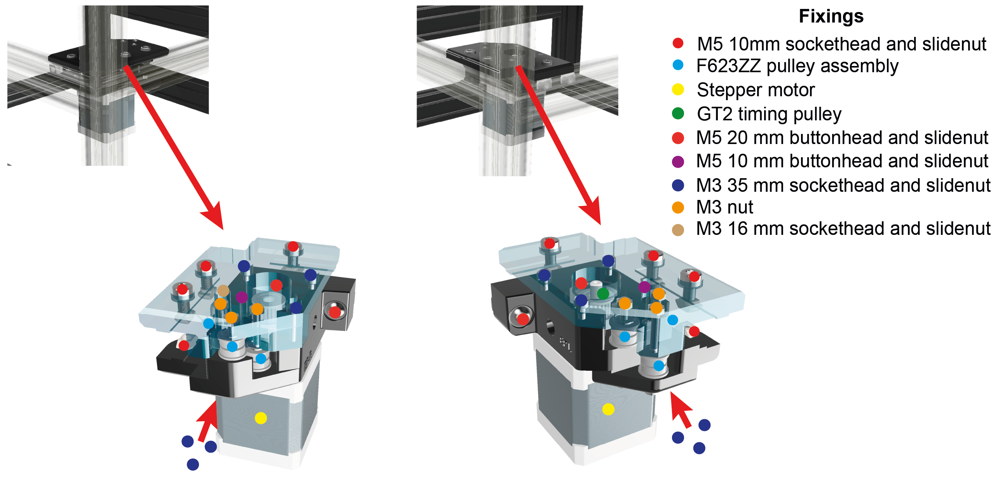

Frame Spacers, Linear Rails and Front corners
======================

**Parts required**

+---------------------------------------+--+--------------+
|                                      |N |Location      |
+=======================================+==+==============+
|**Parts**                                  |  |              |
+---------------------------------------+--+--------------+
|2040 extrusion x 356mm (cross-beams)   |6 |Cross beams   |
+---------------------------------------+--+--------------+
|Linear rails                           |2 |Y-axis        |
+---------------------------------------+--+--------------+
|XY stepper motors                      |2 |Front corners |
+---------------------------------------+--+--------------+
|F623ZZ                                 |4 |Front corners |
+---------------------------------------+--+--------------+
|GT2 timing pulley                      |2 |Front corners |
+---------------------------------------+--+--------------+
|**3D prints**                              |  |              |
+---------------------------------------+--+--------------+
|spacers_back_mid(2).stl                |2 |              |
+---------------------------------------+--+--------------+
|spacers_bottom_back_left.stl           |1 |              |
+---------------------------------------+--+--------------+
|spacers_bottom_back_right.stl          |1 |              |
+---------------------------------------+--+--------------+
|spacers_bottom_side_back_left.stl      |1 |              |
+---------------------------------------+--+--------------+
|spacers_bottom_side_back_right.stl     |1 |              |
+---------------------------------------+--+--------------+
|spacers_bottom_side_front_right.stl    |1 |              |
+---------------------------------------+--+--------------+
|spacers_bottom_side.stl                |1 |              |
+---------------------------------------+--+--------------+
|spacers_front_bottom_left.stl          |1 |              |
+---------------------------------------+--+--------------+
|spacers_front_bottom_right.stl         |1 |              |
+---------------------------------------+--+--------------+
|spacers_mid_and_top_bracket_anti(4).stl|4 |              |
+---------------------------------------+--+--------------+
|spacers_mid_and_top_bracket(4).stl     |4 |              |
+---------------------------------------+--+--------------+
|spacers_top_back_left.stl              |1 |              |
+---------------------------------------+--+--------------+
|spacers_top_back_right.stl             |1 |              |
+---------------------------------------+--+--------------+
|front_corner_left_bottom_small.stl     |1 |              |
+---------------------------------------+--+--------------+
|front_corner_left_bottom.stl           |1 |              |
+---------------------------------------+--+--------------+
|front_corner_left_top.stl              |1 |              |
+---------------------------------------+--+--------------+
|front_corner_right_bottom.stl          |1 |              |
+---------------------------------------+--+--------------+
|front_corner_right_top.stl             |1 |              |
+---------------------------------------+--+--------------+

LabEmbryoCam frame
---------------
Before proceeding with assembling the instrument, it is easiest to loosely attach the two y-axis linear rails with 8 mm countersunk bolts and slide nuts. Tighten just enough to stop them falling off when you turn the extrusion upside down. These rails are what will enable the 'carriage' to slide back and forth. Attach one linear rail to each of 356 mm 2040 pieces of aluminium extrusion. 

Now, insert M5 bolts and slide nuts through the holes of all of the 3D printed spacer parts before attempting to fit them. Make sure to push the bolts all the way through the 3D printed part and ensure it turns freely before proceeding. Screw the slide nut onto the bolt, but only one turn. Note that the spacers should have the smooth part facing outwards, and that there are different sizes for different positions on the instrument.
 
Ensure the two pieces of extrusion with linear rails attached to them, are attached front-to back on the layer above the bottom-most layer. If in doubt, check the CAD model. When installing these pieces of extrusion, the linear rail should be on the side of the extrusion closest to the centre of the instrument. 

Continue assembling the infrom the bottom-up. First insert the spacers that will sit on the previously assembled bottom rectangle of extrusion. Line up the slide nuts in these 3D printed parts with the groove of the extrusion and insert them, before tightening. Note when tightening that the part should be pulled towards the extrusion - i.e. the two are bound together. If this does not happen, try untightening the slide nut and repeating the process. 

.. raw:: html

    <iframe src="https://plymouth222.autodesk360.com/shares/public/SH35dfcQT936092f0e437cf5bbca7ac59d0d?mode=embed" width="640" height="480" allowfullscreen="true" webkitallowfullscreen="true" mozallowfullscreen="true"  frameborder="0"></iframe>

`Installing spacers and building the frame`

Front motion corners
---------------
.. note:: The front corners have multiple types of screw, and different 3D printed parts, and the left and right sides are not symmetrical. You are encouraged to consult the CAD model and images for clarity.
  
Begin by inserting the M5 bolts through the front_corner_left_bottom and front_corner_right_bottom 3D printed parts, ensuring that the screws rotate freely, before then loosely attaching the slidenuts.

Attach the front corners as shown below - noting that the extrusion here has been coloured transparent to aid clarity. You should be attaching the appropriate parts to each of the inner front corners of the instrument.

`Front corner bottom parts`

.. note:: Once attached, both of the lower front corner parts should be flush with the top of the extrusions to which they are attached.

The LabEmbryoCam makes use of some 'home-made' pulleys, using 3 x M3 washers interleaved between 2 x F623ZZ
flanged bearings, as shown below. The belts run over the flanged bearings - so ensure the flanges are on the outer 
edge to guide the belt (as seen below).

.. figure:: ../_static/pulley.png
  :width: 250
`F623ZZ pulley assemblies`

Each front corner, will incorporate three of these pulleys, and they are critical to the XY motion of the instrument. At this stage, begin 
to attach the screws (note the lengths and types from the CAD model below) to the front corners responsible for mounting the stepper 
motors and pulleys. 

See below for an interactive CAD window to view the locations of components in the front corners, including the long bolts for
the stepper motions. Note that the mounting orientation for the stepper motor does not really matter, but having 
the cable attachments facing towards the front of the instrument makes routing cables tidier.

.. raw:: html

  <iframe src="https://plymouth222.autodesk360.com/shares/public/SH35dfcQT936092f0e43dc4b1c1085026d80?mode=embed" width="640" height="480" allowfullscreen="true" webkitallowfullscreen="true" mozallowfullscreen="true"  frameborder="0"></iframe>
`Front corners`

The top and bottom 3D printed pieces for each corner fit together, but should be very snug so will require pressure to fit together. Consult the CAD above if unsure about how these parts fit together.

Continue to: :doc:`6controls_and_vibration`
