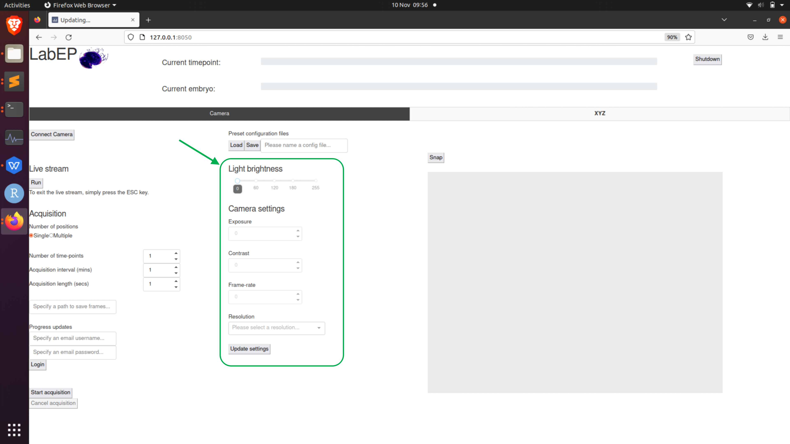

.. _camera-options:

Camera settings
===============

The LabEmbryoCam is built to work with the Raspberry Pi HQ camera, but can support other cameras, with appropriate drivers and linking functions in the LabEmbryoCam app. The camera connects automatically when starting the app. Select the desired Resolution and Exposure, and click 'Update settings' to update the camera. 

Clicking Snap will capture a still image, or Start/Stop Stream will initiate a live video from the camera. This live stream can then be used to configure other aspects of the instrument, such as setting X, Y and Z positions.

Once the camera is live, you can then focus the camera - large changes to focus are acheived by manually sliding the camera carriage up, or down, but focus can also be adjusted using the z-axis buttons. The lens included in the bill of materials is a low cost lens, with a broad range of magnification. Note that at higher magnification, the lens must be closer to the sampler. The working distance (distance between the sample and lens) will vary depending on the lens being used.

.. note::
	The XYZ movement must first be calibrated, via setting the origin, before you can move the instrument using either the joystick or z-buttons. This means that the stage should always work from (0,0,0) and positions should be repeatable between acquisitions i.e. if you save a set of positions, you can revisit the same positions if you reload them.

Light brightness
--------------

The light brightness can be set with a slider until your desired brightness is achieved. Note that if you would like to achieve higher frame-rate in image capture, you can turn the LED brightness up whilst also reducing the exposure time to keep the illumination of the sample the same. The light turns off when the camera is not acquiring.

Camera options
--------------
	- **Exposure time**
		The shutter speed at which the camera operates in milliseconds
	- **Contrast**
		Contrast of the images acquired
	- **Frame-rate**
		The frame-rate at which videos are captured. Note that for high resolutions, such as 2048x2048, you will need to reduce exposure time below 10ms if you would like to achieve a frame-rate higher than 15-20fps. This is due to hard limit set by the `raspividyuv` software on raspberry pi. 
	- **Resolution**
		Presets for resolution at which images will be captured.

.. note::
	Any time you wish to change settings, you need to make sure that the camera is inactive (i.e. not capturing for a live stream or acquisition) and to press the `Update Settings` button. The drivers for the Raspberry Pi HQ camera are quite stable, but in the event of the camera, or any other part of the system becoming unresponsive, please restart the computer.

