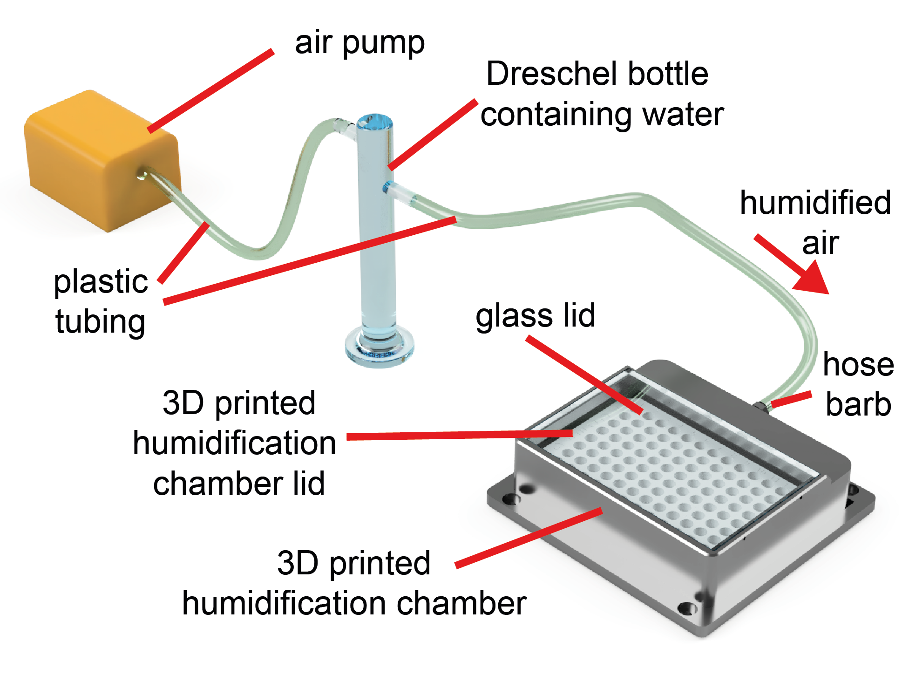

Humidification chamber
===========

**Parts Required**

+------------------------------------------+--+----------------------+
|                                         |n |Location              |
+==========================================+==+======================+
|**Parts**                                 |  |                      |
+------------------------------------------+--+----------------------+
|Hose barb                                 |  |humidification chamber|
+------------------------------------------+--+----------------------+
|Glass lid (4mm float glass -  128 x 85 mm)|  |humidification chamber|
+------------------------------------------+--+----------------------+
|Dreschel gas washing bottle 100ml         |  |humidification chamber|
+------------------------------------------+--+----------------------+
|**3D prints**                             |  |                      |
+------------------------------------------+--+----------------------+
|humidification_chamber_lid.stl            |  |humidification chamber|
+------------------------------------------+--+----------------------+
|humidification_chamber_main.stl           |  |humidification chamber|
+------------------------------------------+--+----------------------+
|humidification_chamber_mount.stl          |  |humidification chamber|
+------------------------------------------+--+----------------------+

Evaporation and condensation are key challenges in the maintenance and visualisation of developing aquatic 
embryos. 

A cheap, yet effective, solution to this challenge, is a 3D printed humidifiction chamber. This humidification module is 
succesful in achieving > 90 % humidity, thereby reducing evaporation to negligible levels. It is not, however, essential to the succesful 
operation of the LabEmbryoCam, for which multiwell plate and petri dish mounts are avaialable.

Continue to :doc:`10lid`

