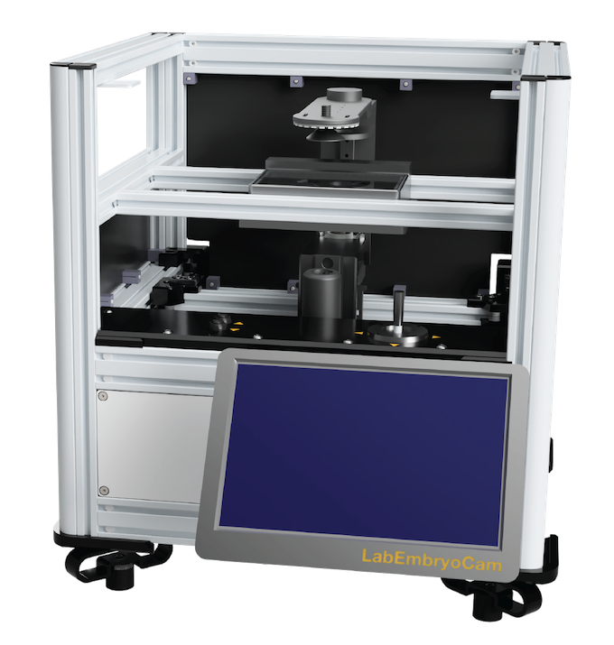

# LabEmbryoCam User Guide



#### ***An opensource platform for automated measurement of developing animals. The LabEmbryoCam is a project originating with the EmbryoPhenomics research group at the University of Plymouth, UK. It has been made possible by support from UKRI, NERC, BBSRC and Plymouth Science Park.***


***Consider joining the Google Group https://groups.google.com/g/labembryocam. Doing so will help contribute to the advancement of this opensource project, and staying up-to date with updates and receiving support.***


-----------------
# INDEX
-----------------
* **1. HARDWARE SETUP**

* **2. USER INTERFACE**

* **3. XYZ CONTROLS AND SETTINGS**

* **4. CAMERA VIEW**

* **5. USING MANUAL CONTROLS TO FIND AND SAVE POSITIONS**

* **6. SETTING AND STARTING ACQUISITIONS**

* **7. NEXT STEPS**

-----------------


<center>THIS IS A LIVE DOCUMENT.</center>


<center>TO SEE THE MOST RECENT VERSION, SCAN THE QR CODE BELOW.</center>


-----------------
# 1. HARDWARE SETUP
-----------------
The LEC is a versatile multidimensional imaging platform. A broad range of magnifications are possible, using different optical hardware, particularly lenses. 

The distance between the sample and the lens will depend on the magnification and lens characteristics. Similarly, the optimum distance between the sample and the light will depend on the optical hardware, magnification, but also the sample type.

The LEC was initially developed for dark field imaging of developing aquatic embryos. Dark field imaging, in which a black background is achieved via lighting arriving at the sample from an oblique angle, works well for imaging developing embryos.


-----------------
# 2. USER INTERFACE
-----------------

Once you have powered on your system, you can enter the desktop environment of the LEC using the following password: `pi`. Once you have logged in, you can start the LabEmbryoCam (LEC) user interface by double clicking the icon on the desktop or in the Activities panel:


A terminal window will automatically open followed by the browser with the webserver (user interface) loaded. We can now proceed with getting the hardware set up for running an experiment. When the LEC user interface first loads, it connects to the various hardware components automatically - give it a few seconds before interacting with it to allow this process to complete.


The LEC user interface is divided into a number of sections
* A) **Experiment Settings** - for loading a configuration file to repopulate previously used settings.
* B) **Camera View** - for adjusting the camera, streaming the camera feed, and snapping still images.
* C) **XYZ controls and settings** - for homing the XYZ stage, and moving the optics carriage around.
* D) **XYZ Positions** - for populating a list of XYZ positions.
* E) **XYZ View** - for interacting with XYZ positions, and automatically generating positions for wells of multiwell plates.
* F) **Experiment setup** - for configuring and running experiments - either at a single positon, or multiple.
* G) **Experiment Progress** - for monitoring the progress of an experiment.


-----------------
# 3. XYZ CONTROLS AND SETTINGS
-----------------
The first step required in setting up any experiment with the LEC is to home, or 'Set Origin' of the XYZ stage. This is essential to ensure that the correct origin is used when finding and creating positions and without doing this the XYZ stage will not be responsive. 

To home the stage, click the `Set Origin` button in the user interface.

***Before homing the stage, make sure there are no objects that could obstruct the movement of the stage - such as the lens being too high. Also, make sure not to use the app whilst the stage is homing as this could interfere with the process.***


-----------------
# 4. CAMERA VIEW
-----------------
Camera and lighting settings will need adjusting to suit your experimental system - species, study aim etc.  

Adjusting the camera and lighting settings can simply be achieved using the `Camera View` section of the user interface: 


Begin by choosing a resolution and these are dictated by the sensor modes available from the connected camera board. Currently there are two camera boards supplied with each LEC system: a global and a rolling shutter camera. The global shutter board only has one available sensor mode: 1456 x 1088 pixels @ 60 fps. The rolling shutter board has four different sensor modes: 1330 x 990 @ 120fps, 2028 x 1080 @ 50fps, 2028 x 1520 @ 40fps and 4032 x 3040 @ 10fps. Note that these framerates are a maximum achievable given low enough exposure times. 

A live stream can be initialised using 'Start/Stop Stream' - and a rotating cursor next to the button will indicate that the camera is running.

Use the live display to ascertain what changes, if any, may be required.

Note that the image you see, is smaller i.e. downsampled to fit on the display and to aid usability. You can Stop the stream and change to 'Desktop' if desired and when the stream is re-enabled a pop-up window will show you what the camera feed looks like in a larger window. You can also capture still images using the 'Snap' button, and these will be shown as interactive images in the 'Still Image' tab. 

You can then use the three tabs - LED, Exposure and Frame-rate, to make adjustments as required. However, changes to the camera's - exposure, frame rate, and resolution, should only be made when the 'Start/Stop Stream is deactivated. **Changes are only implemented when clicking 'Update'.**

The following are descriptions for each of the settings in the Camera View.
* **LED**: The percentage brightness of the LED ring light. Note that the lighting can also be adjusted by using the lighting mount up and down, and by screwing/unscrewing the darkfield adapter. The LED will by default go to sleep when not needed during an experiment.
* **Exposure**: The shutter speed at which the camera operates in milliseconds - 20 ms is a good starting point.
* **Analogue gain**: The analogue gain applied by the camera sensor, to be used too adjust the brightness of the images without affecting frame-rate. 
* **Frame-rate**: The frame-rate at which videos are captured, in frames per second.
* **Resolution**: Presets for resolution at which images will be captured - this is dependent on the available sensor modes for the connected camera board.

***For changes to the camera settings to take effect you must press the `Update` button at the bottom of the Camera Settings section.***

**Note**
There are two physical adjustable parameters on the lens itself, the iris and the magnification. The upper adjustment ring is for adjusting the magnification and the lower adjustment ring is for adjusting the iris. If you change the magnification, the required distance between the sample in the multiwell plate and the lens will need to be changed as well - higher magnification requires the lens to be closer to the sample, it will also result in a darker image and perhaps even a requirement for more light (either by choosing a longer exposure, increasing the brightness of the LED, or adjusting the physical position of the light). Finally, by opening or closing the iris, the depth of field (i.e. depth of the sample that is in focus) can be adjusted. Typically greater depth of field is very welcome, but it comes at the cost of a darker image. So, a compromise is required and will need to be decided on a case-by-case basis.

*Insert lense info here* **To do**

Two lenses are supplied with the LEC, a low magnification lens (specs) suitable for imaging whole wells in a multiwell plate and a higher magnification, variable zoom lens capable of imaging small specimens with the aid of auxillary lenses. The maximum field of view for the Hikrobot, low magnification lens is 83 x 62 mm (width x height), and the minimum field of view, i.e. at highest magnification, is 18 x 13.5 mm. By comparison, the higher magnification lens ...


Next to the 'Start/Stop Stream' button in the Camera View, is a 'Snap' button. This allows you to capture images dynamically while using the instrument. They are automatically saved in a 'snap-images' folder in the LEC application folder.

Still images are interactive, so you can zoom in and out, and move the image to find an improved view. Before starting the next step, you may wish to start the live video stream, if you haven't already, for easily finding the animals or subjects you wish to record using the LEC.

***If you would like to change the camera settings you must exit the live stream before doing this so that your changes can take effect. Then when you have finished choosing your desired setttings, press the `Update` button before starting the live stream again.***


-----------------
# 5. USING MANUAL CONTROLS TO FIND AND SAVE POSITIONS
-----------------

The manual controls can be used once the stage has finished homing. These can be found in **XYZ controls and settings**:


The four buttons determine the step size of the movements of the XYZ stage - from 10mm to 0.01mm. Large movements are more easily achieved with a 10 mm step size, whereas smaller movements require a smaller step size. The stage will complete one 'step' for each press of the relevant button.

In conjunction with the camera live video stream, move the stage using the manual controls to move the camera to a desired position. Once you have a position that you want, click the `Current` button in the xyz section to record the current position:


This will add a position entry into the position list. Note that all columns and rows in the table are editable - so you can give the position a name/label.

You can repeat this step until you have recorded all the positions you want. Once you have completed recording positions, the next step is to enter the parameters for the acquisition before starting the experiment. 

The following are descriptions for each of the controls and components in the XYZ controls and settings section of the user interface:

* **Set Origin**: Press this button to home the stage at startup of the user interface
* **Left group of arrows**: These arrows correspond to moving the stage in the X and Y axis, you can move the stage forward (down arrow), backward (up arrow), left and right, but also diagonally.
* **Right group of arrows**: These arrows move the stage up and down in the Z axis.

The **XYZ View** section will populate with the relative positions of the XYZ positions that you record. If you click the toggle switch **Activate graph** this will mean that positions clicked on in this window will move the stage to that position. This is an effective way of quickly reviewing and adjusting positions.

* **Activate graph**: Enabling this switch will allow you to click on positions on the graph and then the stage will move to the select position. This can be an easy way to double-check all your positions are correct whilst you have a live stream open.

Additionally, the other settings in the **XYZ View** are:
* **Dimension**: Enabling this switch can switch between 2D or 3D view in the position plot, 3D view can be useful for visualising the z axis positions (i.e. seeing the relative heights of different positions).
* **Generate XY**: This enables the automatic creation of the entirety of a multiwell plate's positions. This is deactivated, unless you first create a position (using the **XYZ Positions** section - see below) labelled A1 (corresponding to the top left corner of a multiwell plate. Once this is done, the **Generate XY** will use this position as the basis to create X and Y coordinates for all subsequent wells. 24, 48, 96 and 384 well plates are included.
  

The **XYZ Positions** section enables creation of X, Y and Z position lists:

* **Current**: Press this button to retrieve the coordinates of the current position where the stage is at. A new entry will be added into the position list below where it can be edited further.
* **Replace**: Press this button to replace the coordinates of the selected position with those at the current position of the stage. This can be used to update a position if an animal has moved or gone out of focus. **Note that you must select a position in the position list table via clicking on the circle icon in the second column of the position list for the position you’d like to replace.**
* **Position list table**: Position list where coordinates are recorded. The first column is for removing position entries from the list, simply click the x icon for the position you’d like to remove. The second column is to permit selection of specific position entries for updating their coordinates. Finally, columns X, Y, Z and Label are all editable similar to an excel spreadsheet.


-----------------
# 6. SETTING AND STARTING ACQUISITIONS
-----------------

The acquisition parameters can be found at the bottom of the page of the user interface in the Acquisition section:


Here are descriptions for each acquisition parameter:
* **Number of positions**: Whether you would like to capture footage for only the current position (‘Single’) or all the XYZ positions you have recorded (‘Multiple’).
* **Number of timepoints**: How many acquisition iterations you would like the system to complete. An iteration consists of capturing footage for the specified positions. Setting the acquisition interval allows us to set this process to complete every X minutes, where X would be the acquisition interval.
* **Acquisition interval**: How long to wait between each timepoint in minutes - you must consider how long it will take for each acquisition to complete, or risk the previous acquisition not finishing before the next starts.
* **Acquisition length**: How long to acquire video for each position, at each timepoint.
* **Driver and Folder selection**: The full file path to the directory where you would like to save video. This should be selected using the Select button and navigating the browser that pops up.
* **Turn off light between timepoints**: Whether to turn the LED light ring off between timepoints during an acquisition. 

Once you have added in your desired acquisition parameters, you can now start an acquisition using the Start acquisition button.

**Note**
If you would like to receive email updates and your LEC is connected to a network via WiFi or ethernet, then you simply need to edit the `app_config.json` folder located in the source code folder (`/home/pi/LabEmbryoCam_V2/software/`), with the following changes:

```
	"emails": "on", # Change to "off" if you would like to turn off email updates.
	"email_username": "username@gmail.com", 
	"email_password": "password", # Must be an app password
```

The email updates module for the LEC uses gmail so you will need to register an account with gmail and create an app password (see https://support.google.com/mail/answer/185833?hl=en-GB). You will need to specify this app password in the `email_password` argument. 

Finally, progress of the experiment will be shown at the bottom of the user interface in the 'Experiment Progress' section. This enables tracking the progress of an experiment.


------

# 6. NEXT STEPS

------

After running an experiment you are strongly encouraged to make a backup of your video and ensure you have a good record of the settings, and hardware setup. This should  include an image of a graticule slide captured at the same magnification as used in the experiment - if you intend to make spatial measurements. You can use the 'Snap' function to produce this.  

The analysis of your video will be highly dependant on study species, aims and the scale of the study. We provide a number of workflows, Python packages and guides on the processing and analysis of the types of video dataset produced using the LEC.

https://github.com/EmbryoPhenomics/LabEmbryoCam_V2/tree/main/documentation/processing_video
