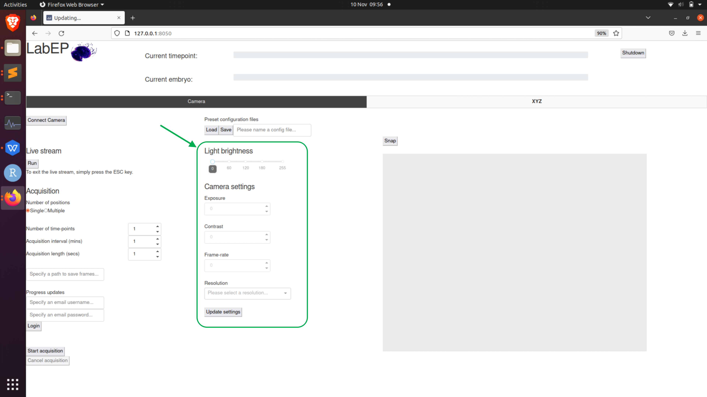

.. _camera-options:

Camera settings
===============

LED brightness
--------------

Set this via scrolling the slider until your desired brightness is achieved. Note that if you would like to achieve higher frame-rate in image capture, you can turn the LED brightness up whilst also reducing the exposure time to keep the illumination of the sample the same. 

Camera options
--------------
	- **Exposure time**
		The shutter speed at which the camera operates in milliseconds
	- **Contrast**
		Contrast of the images acquired
	- **Frame-rate**
		The frame-rate at which videos are captured. Note that for high resolutions, such as 2048x2048, you will need to reduce exposure time below 10ms if you would like to achieve a frame-rate higher than 15-20fps. This is due to hard limit set by the `raspividyuv` software on raspberry pi. 
	- **Resolution**
		Presets for resolution at which images will be captured.

.. note::
	Any time you wish to change settings, you need to make sure that the camera is inactive (i.e. not capturing for a live stream or acquisition) and to press the `Update Settings` button. 

.. +----------------------+----------------------------------------------------------+------+-----------------+----------+-----------+--------------------------------------------------------------------------------------------------------------------------------------------+
.. |Category             |Description                                               |Number|Supplier         |Indv Price|Total Price|Link                                                                                                                                        |
.. +======================+==========================================================+======+=================+==========+===========+============================================================================================================================================+
.. |Mechanical            |2040 extrusion x 420mm (uprights)                         |4     |Aluminium-profile|£6.64     |£26.56     |https://www.aluminium-profile.co.uk/20x40-aluminium-profile-kjn992891                                                                       |
.. +----------------------+----------------------------------------------------------+------+-----------------+----------+-----------+--------------------------------------------------------------------------------------------------------------------------------------------+
.. |Mechanical            |2020 extrusion x 336mm (front-back laterals)              |8     |Aluminium-profile|£5.54     |£44.32     |https://www.aluminium-profile.co.uk/20x20-aluminium-profile-kjn992888#                                                                      |
.. +----------------------+----------------------------------------------------------+------+-----------------+----------+-----------+--------------------------------------------------------------------------------------------------------------------------------------------+
.. |Mechanical            |2040 extrusion x 356mm (cross-beams)                      |6     |Aluminium-profile|£5.80     |£34.80     |https://www.aluminium-profile.co.uk/20x40-aluminium-profile-kjn992891                                                                       |
.. +----------------------+----------------------------------------------------------+------+-----------------+----------+-----------+--------------------------------------------------------------------------------------------------------------------------------------------+
.. |Mechanical            |2020 extrusion x 340mm (sample holders & x-axis)          |3     |Aluminium-profile|£3.84     |£11.52     |https://www.aluminium-profile.co.uk/20x20-aluminium-profile-kjn992888#                                                                      |
.. +----------------------+----------------------------------------------------------+------+-----------------+----------+-----------+--------------------------------------------------------------------------------------------------------------------------------------------+
.. |Mechanical            |X, Y, Z Linear rails                                      |3     |Igus             |£27.80    |£83.40     |https://www.igus.co.uk/product/730?artNr=TS-04-12                                                                                           |
.. +----------------------+----------------------------------------------------------+------+-----------------+----------+-----------+--------------------------------------------------------------------------------------------------------------------------------------------+
.. |Mechanical            |Sorbothane isolators - set of 4                           |1     |Thorlabs         |£23.59    |£23.59     |https://www.thorlabs.com/thorproduct.cfm?partnumber=AV4/M                                                                                   |
.. +----------------------+----------------------------------------------------------+------+-----------------+----------+-----------+--------------------------------------------------------------------------------------------------------------------------------------------+
.. |Mechanical            |Timing belt                                               |1     |PiHut            |£3.50     |£3.50      |https://thepihut.com/products/gt2-6mm-timing-belt-5m-reel?variant=41899086053571                                                            |
.. +----------------------+----------------------------------------------------------+------+-----------------+----------+-----------+--------------------------------------------------------------------------------------------------------------------------------------------+
.. |Motion                |XY stepper motors                                         |2     |RepRap World     |£14.00    |£28.00     |https://reprapworld.co.uk/electronics/3d-printer-modules/stepper-motors/nema17/nema17-stepper-motor-1-8-step-connector-flat-shaft-5-0-kg-cm/|
.. +----------------------+----------------------------------------------------------+------+-----------------+----------+-----------+--------------------------------------------------------------------------------------------------------------------------------------------+
.. |Motion                |Z stepper motor - 21 oz                                   |1     |RepRap World     |£12.50    |£12.50     |https://reprapworld.co.uk/electronics/3d-printer-modules/stepper-motors/nema17/nema17-stepper-motor-slim-1-8-step-1-33-kg-cm/               |
.. +----------------------+----------------------------------------------------------+------+-----------------+----------+-----------+--------------------------------------------------------------------------------------------------------------------------------------------+
.. |Motion                |Minitronics                                               |1     |RepRap World     |£44.00    |£44.00     |https://reprapworld.co.uk/electronics/controller-boards/minitronics/minitronics-v2-0-32-bit-all-in-one-controller-board/                    |
.. +----------------------+----------------------------------------------------------+------+-----------------+----------+-----------+--------------------------------------------------------------------------------------------------------------------------------------------+
.. |Motion                |Stepper driver heatsinks                                  |3     |Ooznest          |£1.00     |£3.00      |https://ooznest.co.uk/product/stepper-motor-driver-heatsink/                                                                                |
.. +----------------------+----------------------------------------------------------+------+-----------------+----------+-----------+--------------------------------------------------------------------------------------------------------------------------------------------+
.. |Motion                |Limit switches                                            |3     |RepRap World     |£2.20     |£6.60      |https://reprapworld.co.uk/electronics/3d-printer-modules/endstops/miniature-microswitch/                                                    |
.. +----------------------+----------------------------------------------------------+------+-----------------+----------+-----------+--------------------------------------------------------------------------------------------------------------------------------------------+
.. |Motion                |Limit switch cables                                       |3     |RepRap World     |£1.50     |£4.50      |https://reprapworld.co.uk/cables-and-wiring/wires/pre-crimped/2-wire-24awg-cable-red-black-1m/?lnk=rel                                      |
.. +----------------------+----------------------------------------------------------+------+-----------------+----------+-----------+--------------------------------------------------------------------------------------------------------------------------------------------+
.. |Motion                |Stepper motor cables                                      |3     |RepRap World     |£2.50     |£7.50      |https://reprapworld.co.uk/cables-and-wiring/wires/motor-wiring/connector-cable-for-stepper-motor-100cm-4-leads/                             |
.. +----------------------+----------------------------------------------------------+------+-----------------+----------+-----------+--------------------------------------------------------------------------------------------------------------------------------------------+
.. |Motion                |Flexible motor coupling for Z axis                        |1     |Ooznest          |£3.60     |£3.60      |https://ooznest.co.uk/product/flexible-motor-shaft-coupler/                                                                                 |
.. +----------------------+----------------------------------------------------------+------+-----------------+----------+-----------+--------------------------------------------------------------------------------------------------------------------------------------------+
.. |Motion                |Bearing mount for Z-axis smooth rod                       |1     |RepRap World     |£7.30     |£7.30      |https://reprapworld.co.uk/mechanical/bearings/mountable/kfl8-bearing-axis-mount-for-8mm-smooth-rod-2-pieces/                                |
.. +----------------------+----------------------------------------------------------+------+-----------------+----------+-----------+--------------------------------------------------------------------------------------------------------------------------------------------+
.. |Motion                |Timing pulley                                             |2     |RepRap World     |£5.40     |£5.40      |https://reprapworld.co.uk/mechanical/pulleys/gt2-pulley-15mm-height-16-teeth-6-mm-belt-5-mm-id/                                             |
.. +----------------------+----------------------------------------------------------+------+-----------------+----------+-----------+--------------------------------------------------------------------------------------------------------------------------------------------+
.. |Motion                |Leadscrew(8mm) for Z-axis (85 mm needed)                  |1     |RepRap World     |£14.99    |£14.99     |https://ratrig.com/acme-8mm-lead-screw-custom-size.html                                                                                     |
.. +----------------------+----------------------------------------------------------+------+-----------------+----------+-----------+--------------------------------------------------------------------------------------------------------------------------------------------+
.. |Motion                |Leadscrew(8mm) nut for carriage                           |1     |RepRap World     |£5.30     |£5.30      |https://reprapworld.co.uk/mechanical/linear-motion/tr8x8-leadscrew-nut-8mm/                                                                 |
.. +----------------------+----------------------------------------------------------+------+-----------------+----------+-----------+--------------------------------------------------------------------------------------------------------------------------------------------+
.. |Motion                |Smooth steel rod (2 x 128, 2 x 106) mm needed)            |1     |RepRap World     |£6.50     |£6.50      |https://reprapworld.co.uk/mechanical/frames-and-bars/smooth-rods/mild-steel-smooth-rod-8-mm-100-cm/                                         |
.. +----------------------+----------------------------------------------------------+------+-----------------+----------+-----------+--------------------------------------------------------------------------------------------------------------------------------------------+
.. |Motion                |3mm Cable ties                                            |1     |Amazon           |£4.99     |£4.99      |https://www.amazon.co.uk/100-Pack-Black-Cable-Ties/dp/B08H7Z6BV9                                                                            |
.. +----------------------+----------------------------------------------------------+------+-----------------+----------+-----------+--------------------------------------------------------------------------------------------------------------------------------------------+
.. |Motion                |F623ZZ (10pcs)                                            |2     |RepRap World     |£4.40     |£8.80      |https://reprapworld.co.uk/mechanical/bearings/roller-bearings/f623zz-shielded-ball-bearing-flanged-10-pieces/?ds=true                       |
.. +----------------------+----------------------------------------------------------+------+-----------------+----------+-----------+--------------------------------------------------------------------------------------------------------------------------------------------+
.. |Motion                |Linear bearing (2pcs)                                     |2     |RepRap World     |£2.20     |£4.40      |https://reprapworld.co.uk/mechanical/bearings/linear-bearings/lm8uu-linear-ball-bearing-slide-bush-bushing-2pcs/                            |
.. +----------------------+----------------------------------------------------------+------+-----------------+----------+-----------+--------------------------------------------------------------------------------------------------------------------------------------------+
.. |Compute               |Raspberry Pi 4 8GB                                        |1     |Robotshop        |£106.24   |£106.24    |https://www.robotshop.com/uk/raspberry-pi-4-b-8gb-computer-board.html                                                                       |
.. +----------------------+----------------------------------------------------------+------+-----------------+----------+-----------+--------------------------------------------------------------------------------------------------------------------------------------------+
.. |Compute               |250 TB SSD                                                |1     |PiHut            |£29.90    |£29.90     |https://thepihut.com/products/wd-green-240gb-2-5-ssd                                                                                        |
.. +----------------------+----------------------------------------------------------+------+-----------------+----------+-----------+--------------------------------------------------------------------------------------------------------------------------------------------+
.. |Electrical            |Raspberry Pi USB Power HAT                                |1     |Amazon           |£21.50    |£21.50     |https://www.amazon.co.uk/gp/product/B08PBFSFQN/                                                                                             |
.. +----------------------+----------------------------------------------------------+------+-----------------+----------+-----------+--------------------------------------------------------------------------------------------------------------------------------------------+
.. |Electrical            |Raspberry Pi Wingshield HAT                               |2     |PiHut            |£14.70    |£29.40     |https://shop.pimoroni.com/products/proto-screwshield-wingshield-kit?variant=382366184                                                       |
.. +----------------------+----------------------------------------------------------+------+-----------------+----------+-----------+--------------------------------------------------------------------------------------------------------------------------------------------+
.. |Electrical            |Arduino UNO for CNC, light and joystick                   |3     |RS Components    |£24.24    |£72.72     |https://uk.rs-online.com/web/p/arduino/7154081                                                                                              |
.. +----------------------+----------------------------------------------------------+------+-----------------+----------+-----------+--------------------------------------------------------------------------------------------------------------------------------------------+
.. |Electrical            |USB A cables (0.5m) for Arduino to Pi connection          |3     |Amazon           |£3.99     |£11.97     |https://www.amazon.co.uk/rhinocables-Speed-Printer-Connectors-Male/dp/B08DCGYQ53/                                                           |
.. +----------------------+----------------------------------------------------------+------+-----------------+----------+-----------+--------------------------------------------------------------------------------------------------------------------------------------------+
.. |Electrical            |SSD to USB 3.0 cable                                      |1     |PiHut            |£6.00     |£6.00      |https://thepihut.com/products/ssd-to-usb-3-0-cable-for-raspberry-pi                                                                         |
.. +----------------------+----------------------------------------------------------+------+-----------------+----------+-----------+--------------------------------------------------------------------------------------------------------------------------------------------+
.. |Electrical            |ATX power supply splitter                                 |1     |Robotshop        |£20.35    |£20.35     |https://www.robotshop.com/uk/sparkfun-atx-power-connector-breakout-kit-12v-5v-4-pin.html                                                    |
.. +----------------------+----------------------------------------------------------+------+-----------------+----------+-----------+--------------------------------------------------------------------------------------------------------------------------------------------+
.. |Electrical            |USB-C cables for connecting to ATX 5V output              |2     |Robotshop        |£2.78     |£5.56      |https://www.robotshop.com/uk/usb-c-to-type-a-cable-1m.html                                                                                  |
.. +----------------------+----------------------------------------------------------+------+-----------------+----------+-----------+--------------------------------------------------------------------------------------------------------------------------------------------+
.. |Electrical            |USB-C PSU                                                 |1     |PiHut            |£9.00     |£9.00      |https://thepihut.com/products/raspberry-pi-psu-uk                                                                                           |
.. +----------------------+----------------------------------------------------------+------+-----------------+----------+-----------+--------------------------------------------------------------------------------------------------------------------------------------------+
.. |Electrical            |Waterproof DC power cable set                             |1     |PiHut            |£2.20     |£2.20      |https://thepihut.com/products/waterproof-dc-power-cable-set-5-5-2-1mm                                                                       |
.. +----------------------+----------------------------------------------------------+------+-----------------+----------+-----------+--------------------------------------------------------------------------------------------------------------------------------------------+
.. |Electrical            |Raspberry Pi HQ camera                                    |1     |PiHut            |£57.00    |£57.00     |https://thepihut.com/products/raspberry-pi-high-quality-camera-module                                                                       |
.. +----------------------+----------------------------------------------------------+------+-----------------+----------+-----------+--------------------------------------------------------------------------------------------------------------------------------------------+
.. |Electrical            |XY axes joystick                                          |1     |PuHut            |£20.30    |£20.30     |https://thepihut.com/products/mini-analog-joystick-10k-potentiometers                                                                       |
.. +----------------------+----------------------------------------------------------+------+-----------------+----------+-----------+--------------------------------------------------------------------------------------------------------------------------------------------+
.. |Electrical            |Z-axis buttons                                            |1     |PiHut            |£4.00     |£4.00      |https://thepihut.com/products/12mm-domed-push-button-6-pack                                                                                 |
.. +----------------------+----------------------------------------------------------+------+-----------------+----------+-----------+--------------------------------------------------------------------------------------------------------------------------------------------+
.. |Electrical            |Industrial grade USB hub                                  |1     |PiHut            |£18.50    |£18.50     |https://thepihut.com/products/industrial-grade-dual-host-usb-hub-4x-usb-2-0?                                                                |
.. +----------------------+----------------------------------------------------------+------+-----------------+----------+-----------+--------------------------------------------------------------------------------------------------------------------------------------------+
.. |Optics                |Pimorini microscope lens                                  |1     |Pimorini         |£22.50    |£22.50     |https://shop.pimoroni.com/products/microscope-lens-0-12-1-8x?variant=31885093371987                                                         |
.. +----------------------+----------------------------------------------------------+------+-----------------+----------+-----------+--------------------------------------------------------------------------------------------------------------------------------------------+
.. |Optics                |LED 2 inch light                                          |1     |CoolComponents   |£18.66    |£18.66     |https://coolcomponents.co.uk/products/lumini-led-ring-2-inch-40-x-apa102-2020?_pos=2&_sid=4457cd377&_ss=r                                   |
.. +----------------------+----------------------------------------------------------+------+-----------------+----------+-----------+--------------------------------------------------------------------------------------------------------------------------------------------+
.. |Optics                |CSI to HDMI Adapter for Pi HQ Camera                      |1     |PiHut            |£15.00    |£15.00     |https://thepihut.com/products/csi-to-hdmi-adapter-board-raspberry-pi-hq-camera                                                              |
.. +----------------------+----------------------------------------------------------+------+-----------------+----------+-----------+--------------------------------------------------------------------------------------------------------------------------------------------+
.. |Lid                   |Acrylic sheet(5mm - 357 x 362 & 357 x 120, polished edges)|1     |PlasticPeople    |£14.00    |£14.00     |https://www.theplasticpeople.co.uk/clear-as-glass-acrylic-perspex/                                                                          |
.. +----------------------+----------------------------------------------------------+------+-----------------+----------+-----------+--------------------------------------------------------------------------------------------------------------------------------------------+
.. |Lid                   |Hinges                                                    |2     |PiHut            |£1.00     |£2.00      |https://thepihut.com/products/plastic-hinge-for-20x20-aluminum-extrusion                                                                    |
.. +----------------------+----------------------------------------------------------+------+-----------------+----------+-----------+--------------------------------------------------------------------------------------------------------------------------------------------+
.. |Lid                   |Hose barb                                                 |1     |Amazon           |£7.99     |£7.99      |https://www.amazon.co.uk/gp/product/B09134SBMK/                                                                                             |
.. +----------------------+----------------------------------------------------------+------+-----------------+----------+-----------+--------------------------------------------------------------------------------------------------------------------------------------------+
.. |Humificiation chamber |Glass lid (4mm float glass -  128 x 85 mm)                |1     |Local supplier   |£5.00     |£5.00      |                                                                                                                                            |
.. +----------------------+----------------------------------------------------------+------+-----------------+----------+-----------+--------------------------------------------------------------------------------------------------------------------------------------------+
.. |Humidification chamber|Dreschel gas washing bottle 100ml                         |1     |RapidOnline      |£21.80    |£21.80     |https://www.rapidonline.com/simax-drechsel-gas-washing-bottle-100ml-52-0982                                                                 |
.. +----------------------+----------------------------------------------------------+------+-----------------+----------+-----------+--------------------------------------------------------------------------------------------------------------------------------------------+
.. |Fixings               |From Fixings sheet                                        |1     |Accu             |£133.02   |£133.02    |From Fixings sheet                                                                                                                          |
.. +----------------------+----------------------------------------------------------+------+-----------------+----------+-----------+--------------------------------------------------------------------------------------------------------------------------------------------+
.. |Filament              |Carbon PETG Filament                                      |2     |Farnell          |£46.80    |£93.60     |https://uk.farnell.com/filamentive/10921/3d-printer-filament-1-75mm-grey/dp/2917117?st=filamentive%20carbon                                 |
.. +----------------------+----------------------------------------------------------+------+-----------------+----------+-----------+--------------------------------------------------------------------------------------------------------------------------------------------+
.. |Panels                |3mm plastic panels                                        |assort|SimplyPlastics   |£40.00    |           |https://www.simplyplastics.com                                                                                                              |
.. +----------------------+----------------------------------------------------------+------+-----------------+----------+-----------+--------------------------------------------------------------------------------------------------------------------------------------------+
.. |FIXINGS               |                                                          |      |                 |          |           |                                                                                                                                            |
.. +----------------------+----------------------------------------------------------+------+-----------------+----------+-----------+--------------------------------------------------------------------------------------------------------------------------------------------+
